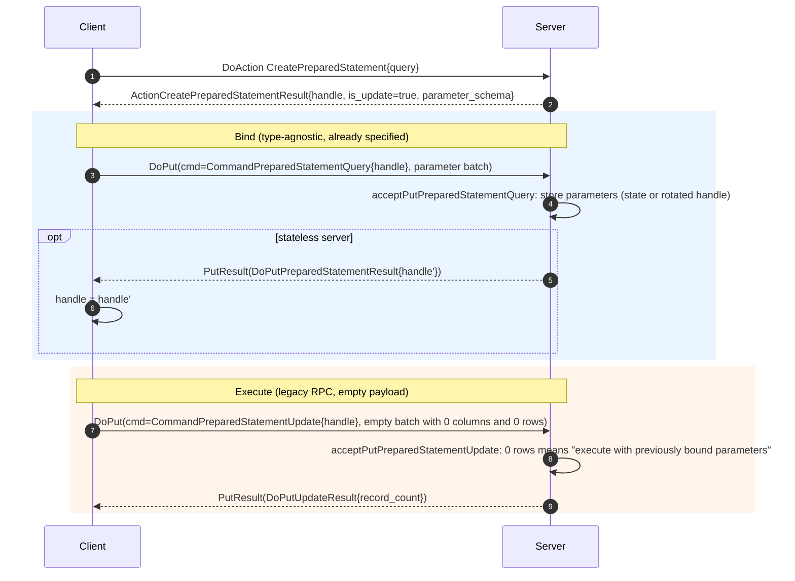
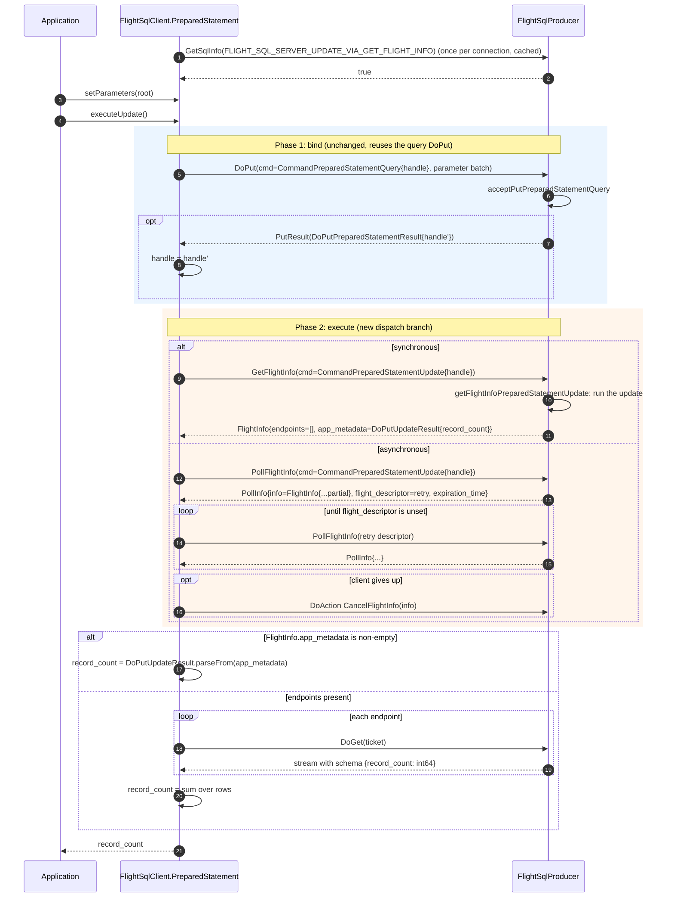
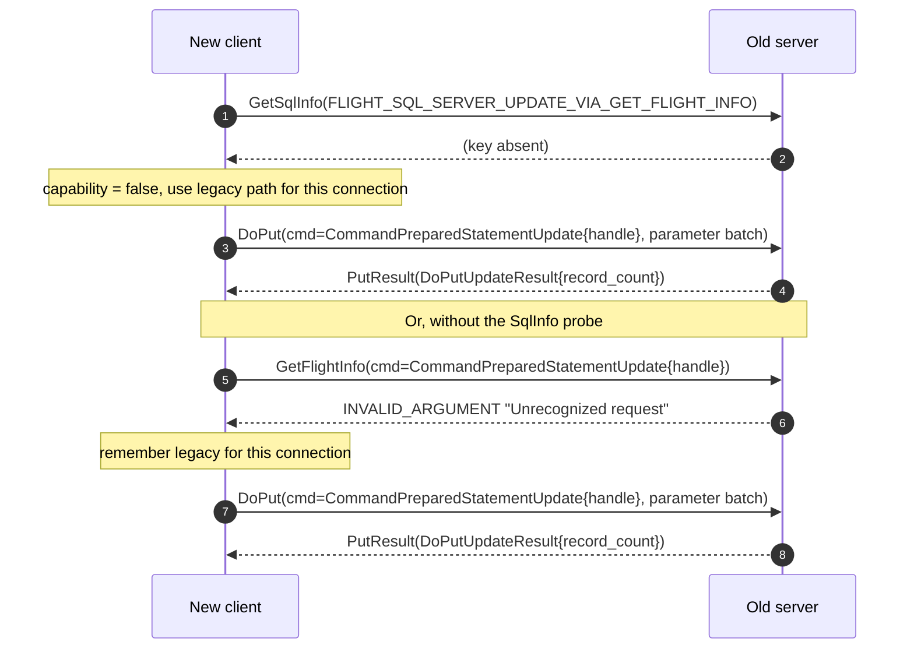

<!---
  Licensed to the Apache Software Foundation (ASF) under one
  or more contributor license agreements.  See the NOTICE file
  distributed with this work for additional information
  regarding copyright ownership.  The ASF licenses this file
  to you under the Apache License, Version 2.0 (the
  "License"); you may not use this file except in compliance
  with the License.  You may obtain a copy of the License at

    http://www.apache.org/licenses/LICENSE-2.0

  Unless required by applicable law or agreed to in writing,
  software distributed under the License is distributed on an
  "AS IS" BASIS, WITHOUT WARRANTIES OR CONDITIONS OF ANY
  KIND, either express or implied.  See the License for the
  specific language governing permissions and limitations
  under the License.
-->

# Detaching execution from parameter binding for `CommandPreparedStatementUpdate`

Companion to [prepared-statement-flows.md](prepared-statement-flows.md), which
describes the protocol as it is today. This document explores how
`CommandPreparedStatementUpdate` could be brought in line with
`CommandPreparedStatementQuery`, so that `DoPut` only binds parameters and a
separate RPC executes the update, without breaking any client that speaks
the current protocol.

## 1. Problem statement

Today the two prepared-statement commands are asymmetric:

| | `CommandPreparedStatementQuery` | `CommandPreparedStatementUpdate` |
| --- | --- | --- |
| `DoPut` | binds parameters, may rotate the handle | binds parameters **and executes** |
| `GetFlightInfo` | executes, returns `FlightInfo` | not accepted (`INVALID_ARGUMENT` in `FlightSqlProducer`) |
| `DoGet` | streams the result set | never used |
| Result | Arrow stream | `DoPutUpdateResult{record_count}` in the `PutResult` ack |

Because execution happens inside the `DoPut` call, an update cannot benefit
from anything that hangs off `FlightInfo`:

- **No asynchronous execution.** `PollFlightInfo` and `PollInfo.expiration_time`
  only exist for `FlightDescriptor` based calls. A long-running
  `INSERT ... SELECT` or `MERGE` has to hold a gRPC bidirectional stream open
  for its whole duration, subject to client and proxy idle timeouts, with no
  way to reconnect and resume.
- **No cancellation.** `CancelFlightInfo` takes a `FlightInfo`, which an update
  never has.
- **No redirection.** `FlightEndpoint.location` lets a coordinator hand result
  retrieval to another node. An update has no endpoints, so the node that
  received the `DoPut` must also run the statement to completion.
- **No stateless "bind now, execute later".** For queries a stateless server
  can fold the bound parameters into the rotated handle returned by
  `DoPutPreparedStatementResult`. For updates the parameters and the
  execution arrive in the same call, so there is nothing to defer.

## 2. Constraints that any solution must respect

These were verified against the Java code in this repository and the C++,
Go and Rust clients in `apache/arrow`, `apache/arrow-go` and
`apache/arrow-rs`.

| # | Constraint | Evidence |
| --- | --- | --- |
| C1 | **Every shipping client sends `DoPut(CommandPreparedStatementUpdate)` and requires a `PutResult` whose metadata parses as `DoPutUpdateResult`.** Java, C++, Go and Rust all fail if the ack is missing. | Java `PreparedStatement.executeUpdate()` dereferences `read.getApplicationMetadata()` without a null check. C++ returns `IOError("Server did not send a response")`. Rust errors with "Server closed the stream without sending a result". |
| C2 | **The ack payload type cannot be sniffed.** `DoPutUpdateResult` and `DoPutPreparedStatementResult` are raw protobuf (not `Any`-wrapped), both use field number 1, and protobuf silently drops fields whose wire type does not match. Parsing one as the other yields an empty message, not an error. | `DoPutUpdateResult.parseFrom(metadata)` in `FlightSqlClient`; `arrow-format/FlightSql.proto` field definitions. |
| C3 | **New request fields are invisible to old servers.** Protobuf unknown fields are ignored, so a new `bind_only`-style flag on the command would be silently dropped by an old server, which would execute anyway. A new client therefore needs a positive capability signal or a deterministic failure it can detect. | Standard protobuf semantics. |
| C4 | **Old servers fail `GetFlightInfo(CommandPreparedStatementUpdate)` deterministically.** The Java dispatcher throws `INVALID_ARGUMENT "Unrecognized request: <type url>"`. | `FlightSqlProducer.getFlightInfo` fall-through. |
| C5 | **Servers already have to accept "bind via `CommandPreparedStatementQuery`, execute via an empty `CommandPreparedStatementUpdate`".** The Rust client does exactly this today, and arrow-rs issue #6560 documents that the spec never said whether the update `DoPut` may carry parameters at all. | Rust `PreparedStatement::execute_update` calls `write_bind_params()` (a `DoPut` with `CommandPreparedStatementQuery`) and then a `DoPut` with `CommandPreparedStatementUpdate` and an empty batch. |
| C6 | **The protocol is owned upstream.** `arrow-format/FlightSql.proto` in this repository is a vendored copy of `format/FlightSql.proto` in `apache/arrow`. Any wire-level change needs a spec change and a vote there first, then adoption in each language. | Repository layout. |
| C7 | **`is_update` already tells clients which command to use.** `ActionCreatePreparedStatementResult.is_update` decides between the query and update paths in the Java client, the JDBC driver and the Go ADBC driver. Any new design must keep that contract. | `ArrowFlightSqlClientHandler.prepare().getType()`. |

C1 is the decisive one: **a server can never stop executing inside
`DoPut(CommandPreparedStatementUpdate)` for a client it does not know to be
new.** Detached execution therefore has to be opt-in from the client side,
and the server must keep the legacy path forever.

## 3. Candidate designs

### Option A. No protocol change: bind with `CommandPreparedStatementQuery`, execute with an empty `CommandPreparedStatementUpdate`

This is the pattern the Rust client already uses (C5). Binding is a
type-agnostic operation, and the spec's wording for the query `DoPut` is
simply "bind parameter values". Execution stays a `DoPut`, but it carries no
parameters and can be issued any time after binding.



Server rule: in `acceptPutPreparedStatementUpdate`, a batch with rows binds and
executes (legacy); a batch with zero rows executes with whatever was bound
earlier for that handle. `FlightSqlExample` already behaves this way by
accident because JDBC keeps the last bound values on the `PreparedStatement`
object. `FlightSqlStatelessExample` does not: it does not override
`acceptPutPreparedStatementUpdate`, so it would need to decode the rotated
handle there as well.

| | Old client | New client |
| --- | --- | --- |
| **Old server** | unchanged | works if the server keeps bound state per handle (stateful); fails on a stateless server that never taught its update path to decode rotated handles |
| **New server** | unchanged | works |

Pros:

- Zero proto or spec changes. Can be adopted unilaterally by any server and
  client pair, and is required anyway for Rust interoperability.
- Binding is genuinely separated from execution; bind once, execute later.

Cons:

- Execution still runs inside a `DoPut`, so none of the `FlightInfo`
  benefits in section 1 (async polling, cancellation, redirection) are gained.
- Relies on a convention ("zero rows means execute what is bound") that the
  spec does not state. It should be written into the spec comments even if
  nothing else changes, which is what arrow-rs #6560 asks for.
- Ambiguity when a new client binds nothing and then sends the empty update:
  identical on the wire to a legacy parameterless update. Harmless, because
  both mean "execute with no parameters".

### Option B. Execute updates through `GetFlightInfo` (recommended)

Make `CommandPreparedStatementUpdate` a valid `GetFlightInfo`,
`PollFlightInfo` and `GetSchema` command, mirroring
`CommandPreparedStatementQuery` exactly. Binding uses the existing query
`DoPut` (as in Option A), so no new bind message is needed. The legacy
`DoPut(CommandPreparedStatementUpdate)` path is kept untouched for old
clients (C1).



Result delivery has two allowed shapes so that simple servers stay simple
and distributed servers get endpoints:

1. **Inline.** `FlightInfo.endpoints` is empty and `FlightInfo.app_metadata`
   holds a serialized `DoPutUpdateResult`. One round trip, no `DoGet`.
   `FlightInfo.app_metadata` already exists in `Flight.proto` and is exposed
   by the Java `FlightInfo` class.
2. **Streamed.** `FlightInfo.endpoints` is non-empty; each `DoGet` returns a
   stream with a fixed schema, proposed as
   `Schemas.UPDATE_RESULT_SCHEMA = {record_count: int64 not null}`, and the
   client sums `record_count` across all rows of all endpoints. This is what
   lets `PollFlightInfo` hand back partial results, and lets a coordinator
   point the client at the node that ran the statement.

Capability discovery: a new boolean `SqlInfo` value, provisionally named
`FLIGHT_SQL_SERVER_UPDATE_VIA_GET_FLIGHT_INFO`, mirrors how
`FLIGHT_SQL_SERVER_BULK_INGESTION` and `FLIGHT_SQL_SERVER_CANCEL` announce
optional features. The client asks once and caches. Absence of the key means
false. As a defensive fallback the client may also treat `INVALID_ARGUMENT`
or `UNIMPLEMENTED` from `GetFlightInfo(CommandPreparedStatementUpdate)` as
"legacy server" (C4), fall back to the legacy `DoPut`, and remember the
answer for the rest of the connection.



Compatibility matrix:

| | Old client | New client |
| --- | --- | --- |
| **Old server** | unchanged | `SqlInfo` says no, or `GetFlightInfo` fails with `INVALID_ARGUMENT`; client uses the legacy `DoPut`. One extra round trip at most, once per connection. |
| **New server** | unchanged: `DoPut(CommandPreparedStatementUpdate)` still binds and executes and returns `DoPutUpdateResult` | detached path |

Per-client impact of the new server, with nothing changed on the client:

| Client | Behaviour against a new server |
| --- | --- |
| Java `FlightSqlClient` (this repo) | unchanged, legacy `DoPut` path |
| Java JDBC driver | unchanged, goes through `FlightSqlClient.PreparedStatement.executeUpdate()` |
| C++ `FlightSqlClient` / ADBC C++ driver | unchanged, legacy `DoPut` path |
| Go `flightsql` / ADBC Go driver | unchanged, legacy `DoPut` path |
| Rust `arrow-flight` | unchanged; its bind-then-empty-update pattern keeps working because the legacy path must honour Option A's zero-row rule anyway |

Pros:

- Full symmetry with `CommandPreparedStatementQuery`: same bind step, same
  execute RPC, same `FlightInfo` object, and therefore `PollFlightInfo`,
  `CancelFlightInfo`, `RenewFlightEndpoint` and endpoint redirection for free.
- No new message types. Only doc comments on an existing message, one new
  `SqlInfo` enum value, one schema constant, and one convention on
  `FlightInfo.app_metadata`.
- Every existing client keeps working with no change and no version check on
  the server side.
- Server implementers are not forced to do anything: the new
  `FlightSqlProducer` methods can have `UNIMPLEMENTED` defaults.

Cons:

- Needs an upstream spec change and adoption in each language (C6). Until
  then it is a Java-only extension that other clients simply do not use.
- Two ways to deliver a row count (inline vs streamed) is a small amount of
  extra client logic. Making inline mandatory and streamed optional keeps
  simple clients simple.
- Binding an update through a message called `...Query` is an aesthetic
  wart. Renaming would need a new message and a bigger compatibility story;
  the Rust precedent suggests living with it and clarifying the docs.

### Option C. A new `DoAction` for execution

Add an action such as `ExecutePreparedStatementUpdate` whose body is the
handle and whose `Result` carries `DoPutUpdateResult`. Binding stays on
`DoPut(CommandPreparedStatementQuery)`.

| | Old client | New client |
| --- | --- | --- |
| **Old server** | unchanged | `DoAction` fails with `INVALID_ARGUMENT "Unrecognized request"`; `ListActions` also lets the client discover support up front |
| **New server** | unchanged | works |

Pros: very small; actions are already the extension point for
`CreatePreparedStatement`, `BeginTransaction` and so on; discovery via
`ListActions` needs no new `SqlInfo`.

Cons: detaches binding from execution but does not give updates a
`FlightInfo`, so none of the async, cancel or redirect benefits. It would
also create a third execution mechanism next to `DoPut` and `GetFlightInfo`.
Only worth it if Option B is rejected upstream.

### Option D. `DoExchange` (apache/arrow issue #37741)

An open proposal to bind and execute in a single `DoExchange` call. It goes
in the opposite direction from this document: it *merges* binding and
execution to cut round trips, and explicitly gives up multi-endpoint
results. Listed here only because it is the other live proposal touching
prepared-statement execution, and because a server adopting Option B would
still be free to add `DoExchange` later as a fast path.

### Option E. Server-side tricks inside the legacy `DoPut` (rejected)

Ideas such as sending an interim `DoPutUpdateResult{record_count=-1}` while
the statement runs, or completing the `DoPut` early and executing in the
background, break C1: existing clients read exactly one `PutResult` and treat
it as final, so they would report `-1` or a phantom success. Not viable.

## 4. Recommendation

Do **Option A now and Option B as the target**, in three steps. They compose:
Option A's zero-row rule is exactly what Option B's legacy path needs.

1. **Harden the legacy `DoPut` path (Option A, no spec change).**
   In `acceptPutPreparedStatementUpdate` implementations, treat a zero-row
   batch as "execute with previously bound parameters", and make stateless
   servers decode rotated handles there too. Document the rule in the proto
   comments. This alone fixes Rust interoperability and gives "bind now,
   execute later" at the `DoPut` level.
2. **Propose Option B upstream** on the Arrow mailing list and as a PR to
   `format/FlightSql.proto` plus `docs/source/format/FlightSql.rst` in
   `apache/arrow`, with the C++ and Java reference implementations. Sketch of
   the proto delta (enum number to be assigned upstream):

   ```proto
   /*
    * Represents a SQL update query. Used in the command member of FlightDescriptor
    * for the following RPC calls:
    *  - DoPut: (legacy) bind parameter values and execute the update in one call.
    *    The server MUST reply with a PutResult carrying DoPutUpdateResult. A stream
    *    with zero rows executes with the parameters most recently bound to the handle.
    *  - GetFlightInfo: execute the prepared update. If the returned FlightInfo has no
    *    endpoints, its app_metadata MUST contain a serialized DoPutUpdateResult.
    *    Otherwise each endpoint yields a stream with the UPDATE_RESULT schema and the
    *    client sums record_count over all rows.
    *  - PollFlightInfo: as GetFlightInfo, for long-running updates.
    *  - GetSchema: return the UPDATE_RESULT schema.
    * Only valid with GetFlightInfo/PollFlightInfo/GetSchema when the server reports
    * FLIGHT_SQL_SERVER_UPDATE_VIA_GET_FLIGHT_INFO = true.
    */
   message CommandPreparedStatementUpdate {
     bytes prepared_statement_handle = 1;
   }

   enum SqlInfo {
     // ...
     /*
      * Retrieves a boolean value indicating whether the Flight SQL Server accepts
      * CommandPreparedStatementUpdate (and CommandStatementUpdate) with the
      * GetFlightInfo, PollFlightInfo and GetSchema RPCs.
      */
     FLIGHT_SQL_SERVER_UPDATE_VIA_GET_FLIGHT_INFO = 12;
   }
   ```

   `CommandStatementUpdate` (the non-prepared form) can be given the same
   treatment in the same proposal for symmetry; it has the same `DoPut`-only
   limitation and the same compatibility profile.
3. **Implement Option B in this repository once the spec lands**, behind the
   `SqlInfo` flag so nothing changes for anyone who does not opt in.

## 5. Concrete change list for Option B in `arrow-java`

Server side (`flight-sql`):

- `FlightSqlProducer.getFlightInfo`: add a branch for
  `CommandPreparedStatementUpdate` calling a new default method
  `getFlightInfoPreparedStatementUpdate(command, context, descriptor)` that
  throws `UNIMPLEMENTED`. A default keeps every existing producer compiling
  and behaving as before (old servers keep failing the call, just with
  `UNIMPLEMENTED` instead of `INVALID_ARGUMENT`; clients should accept both).
- `FlightSqlProducer.getSchema`: return `Schemas.UPDATE_RESULT_SCHEMA` for
  `CommandPreparedStatementUpdate`.
- `FlightSqlProducer.getStream`: dispatch a `CommandPreparedStatementUpdate`
  ticket to a new default `getStreamPreparedStatementUpdate(...)`, for
  servers that choose the streamed result shape and reuse the command as the
  ticket, as `FlightSqlExample` does for queries.
- `FlightSqlProducer.acceptPutPreparedStatementUpdate`: contract unchanged;
  document the zero-row rule from Option A.
- `SqlInfoBuilder`: accept the new key.
- `Schemas`: add `UPDATE_RESULT_SCHEMA`.
- `FlightSqlExample` and `FlightSqlStatelessExample`: implement both new
  methods and advertise the `SqlInfo` flag. The stateless example must also
  decode rotated handles in `acceptPutPreparedStatementUpdate`.
- `arrow-format/FlightSql.proto`: sync from upstream once merged.

Client side (`flight-sql`):

- `FlightSqlClient.PreparedStatement`: add `bindParameters()` (the existing
  private `putParameters` with the query descriptor, made public) and
  `executeUpdateInfo()` returning `FlightInfo`, plus a helper that turns a
  `FlightInfo` into a row count using the inline-or-streamed rule.
- `executeUpdate()`: keep the legacy behaviour as the default. Add an
  opt-in (constructor flag or a cached `SqlInfo` probe) that routes it
  through bind + `GetFlightInfo` when the server advertises support, so JDBC
  and other callers gain the benefit without an API change.
- `FlightSqlClient`: cache the boolean `SqlInfo` answer per client instance;
  today the client does not cache any `SqlInfo`.

JDBC driver (`flight-sql-jdbc-core`):

- No API change. `ArrowFlightMetaImpl.execute` and `prepareAndExecute` keep
  calling `executeUpdate()`. Optionally reuse `ArrowDatabaseMetadata`'s
  existing `SqlInfo` cache to feed the opt-in.
- `Statement.cancel()` can start delegating to `CancelFlightInfo` for
  updates once a `FlightInfo` exists.

Tests:

- Producer-level tests for old-client behaviour against the new example
  servers (legacy `DoPut` still returns `DoPutUpdateResult`).
- Client tests against a producer without the new branches, asserting the
  fallback to the legacy path and that the probe happens once.
- A stateless round trip: bind via `CommandPreparedStatementQuery`, observe
  the rotated handle, execute via `GetFlightInfo(CommandPreparedStatementUpdate)`
  with that handle, and read the count from `app_metadata`.

## 6. Open questions to settle in the spec proposal

- **Multiple binds before one execute.** The query wording says "all of the
  bound parameter sets will be executed as a single atomic execution" for the
  rows in one `DoPut`. Whether a second `DoPut` before execution *replaces* or
  *appends* parameter sets is unspecified. Replacement matches the stateful
  JDBC behaviour and is the simplest to define.
- **Row-count semantics with multiple endpoints.** Proposed: sum of
  `record_count` across all rows of all endpoints; `-1` in any row makes the
  total `-1`.
- **Transactions.** `ActionCreatePreparedStatementRequest.transaction_id` is
  bound at prepare time, so nothing changes, but the spec should say that a
  `PollFlightInfo`-driven update commits (or not) under the same rules as the
  legacy `DoPut`.
- **Handle lifetime.** A stateless server that folds bound parameters into
  the handle should say whether `FLIGHT_SQL_SERVER_STATEMENT_TIMEOUT` applies
  to the bound-but-unexecuted state.

## 7. References

- arrow-rs issue [#6560](https://github.com/apache/arrow-rs/issues/6560):
  Rust binds via `CommandPreparedStatementQuery` and executes via an empty
  `CommandPreparedStatementUpdate`; asks the spec to say whether the update
  `DoPut` may carry parameters.
- apache/arrow issue [#37741](https://github.com/apache/arrow/issues/37741):
  proposal to use `DoExchange` to bind and execute in one call.
- arrow-adbc issue [#4074](https://github.com/apache/arrow-adbc/issues/4074)
  and PR [#4161](https://github.com/apache/arrow-adbc/pull/4161): Go ADBC
  driver choosing the update command from `is_update`.
- `Flight.proto` `PollFlightInfo` and `PollInfo` definitions, and
  `FlightInfo.app_metadata`, in [`arrow-format/Flight.proto`](../../../arrow-format/Flight.proto).
