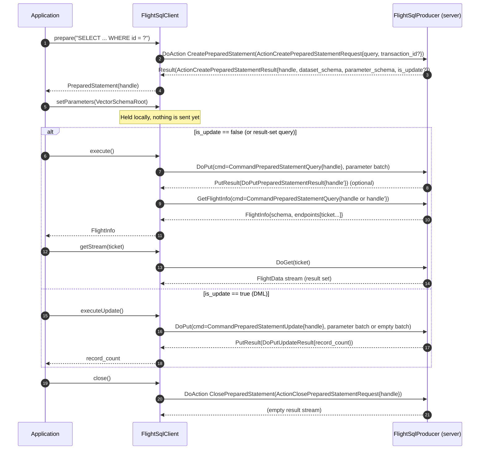
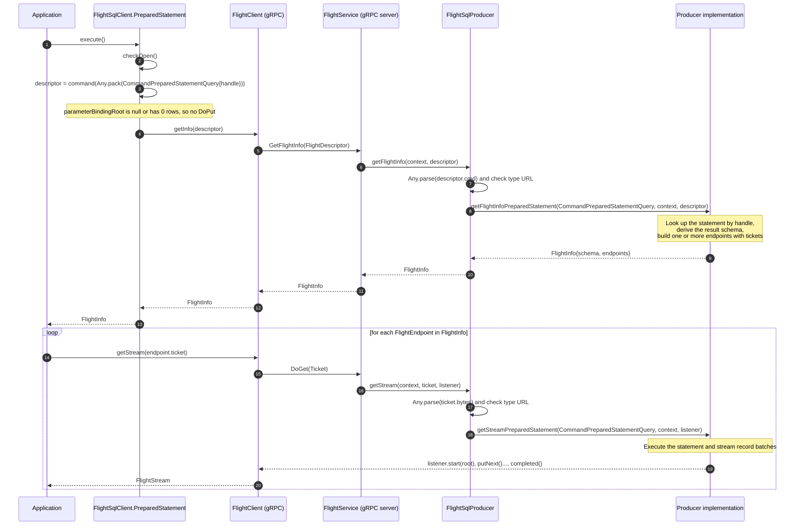
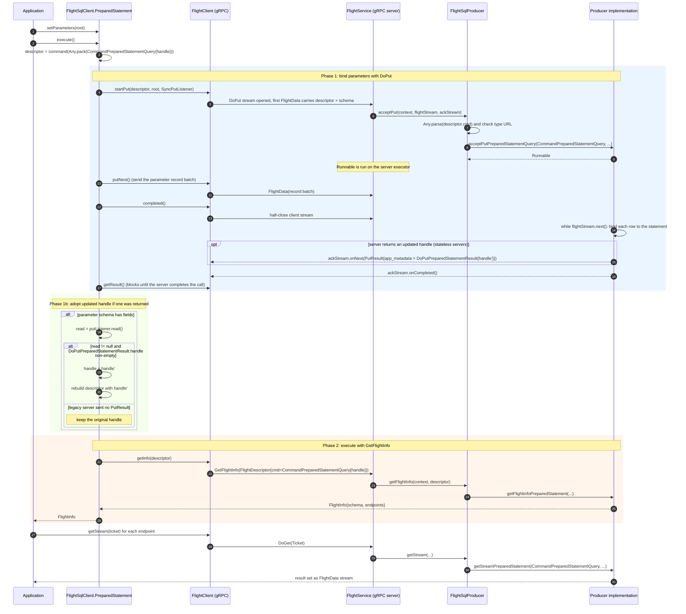
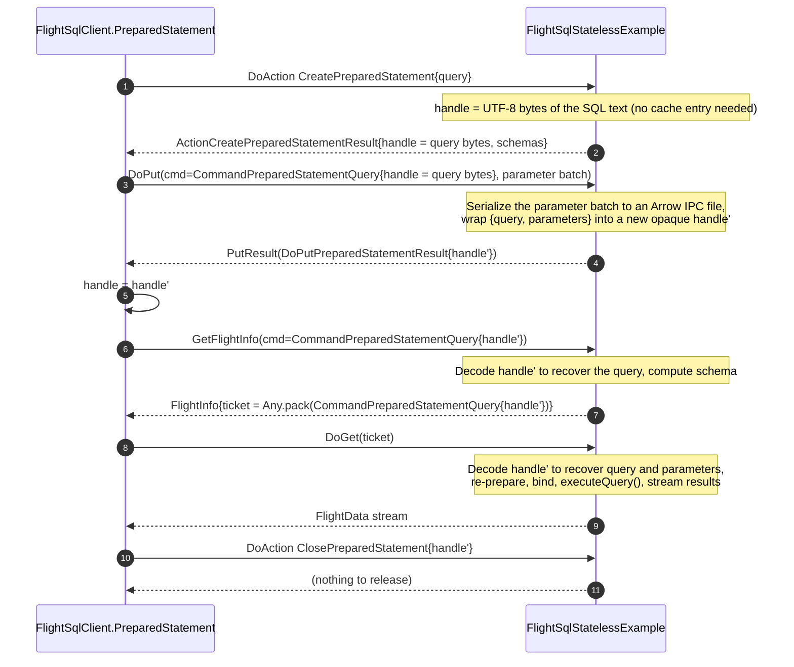
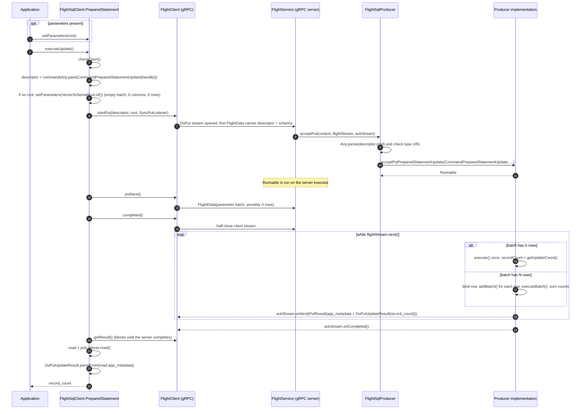
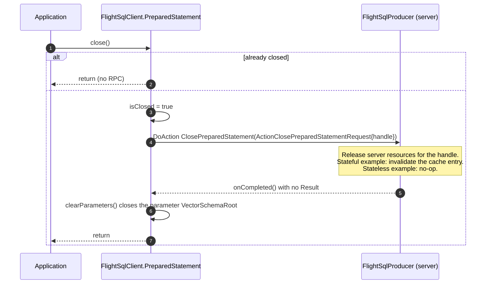
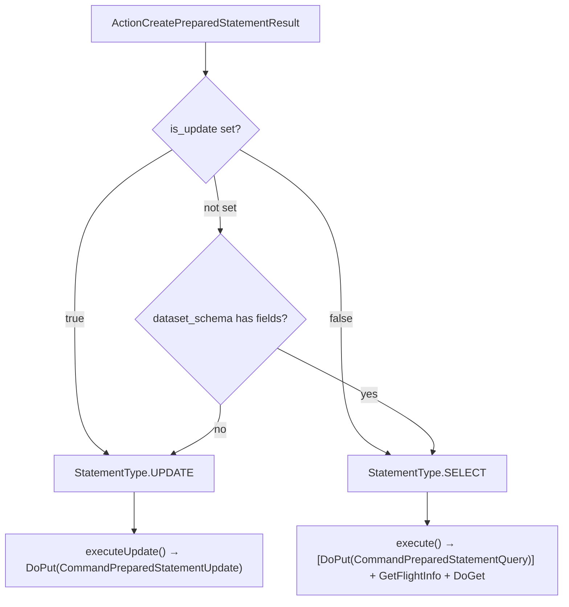

<!---
  Licensed to the Apache Software Foundation (ASF) under one
  or more contributor license agreements.  See the NOTICE file
  distributed with this work for additional information
  regarding copyright ownership.  The ASF licenses this file
  to you under the Apache License, Version 2.0 (the
  "License"); you may not use this file except in compliance
  with the License.  You may obtain a copy of the License at

    http://www.apache.org/licenses/LICENSE-2.0

  Unless required by applicable law or agreed to in writing,
  software distributed under the License is distributed on an
  "AS IS" BASIS, WITHOUT WARRANTIES OR CONDITIONS OF ANY
  KIND, either express or implied.  See the License for the
  specific language governing permissions and limitations
  under the License.
-->

# Flight SQL prepared statements: `CommandPreparedStatementQuery` and `CommandPreparedStatementUpdate`

This document describes how the two prepared-statement *execution* commands of
the Flight SQL protocol map onto the underlying Flight RPCs (`DoAction`,
`DoPut`, `GetFlightInfo`, `DoGet`), and how the Java client and server
implementations in this repository drive them.

The diagrams are written in [Mermaid](https://mermaid.js.org/) and render
directly on GitHub.

Sources of truth used for this document:

- Protocol definition: [`arrow-format/FlightSql.proto`](../../../arrow-format/FlightSql.proto)
- Client: [`FlightSqlClient.PreparedStatement`](../src/main/java/org/apache/arrow/flight/sql/FlightSqlClient.java)
- Server dispatch: [`FlightSqlProducer`](../src/main/java/org/apache/arrow/flight/sql/FlightSqlProducer.java)
- Reference servers: [`FlightSqlExample`](../src/test/java/org/apache/arrow/flight/sql/example/FlightSqlExample.java)
  (stateful) and [`FlightSqlStatelessExample`](../src/test/java/org/apache/arrow/flight/sql/example/FlightSqlStatelessExample.java)
  (stateless)
- JDBC driver: [`ArrowFlightSqlClientHandler`](../../flight-sql-jdbc-core/src/main/java/org/apache/arrow/driver/jdbc/client/ArrowFlightSqlClientHandler.java)
  and [`ArrowFlightMetaImpl`](../../flight-sql-jdbc-core/src/main/java/org/apache/arrow/driver/jdbc/ArrowFlightMetaImpl.java)

## 1. Messages, RPCs and Java entry points

Every Flight SQL request is a protobuf message wrapped in a
`google.protobuf.Any`, carried either in the `body` of an `Action`
(`DoAction`), in the `cmd` of a `FlightDescriptor` (`GetFlightInfo`,
`GetSchema`, `DoPut`) or in the bytes of a `Ticket` (`DoGet`).
`FlightSqlProducer` unpacks the `Any`, inspects its type URL and dispatches
to a type-specific method.

| Protobuf message | Carried in | Flight RPC | Client call (`FlightSqlClient`) | Server method (`FlightSqlProducer`) |
| --- | --- | --- | --- | --- |
| `ActionCreatePreparedStatementRequest` | `Action.body` | `DoAction("CreatePreparedStatement")` | `prepare(query)` | `createPreparedStatement(...)` |
| `ActionCreatePreparedStatementResult` | `Result.body` | reply to the action above | `PreparedStatement` constructor | (returned by the server) |
| `CommandPreparedStatementQuery` | `FlightDescriptor.cmd` | `DoPut` | `PreparedStatement.execute()` when parameters are bound | `acceptPutPreparedStatementQuery(...)` |
| `CommandPreparedStatementQuery` | `FlightDescriptor.cmd` | `GetFlightInfo` | `PreparedStatement.execute()` | `getFlightInfoPreparedStatement(...)` |
| `CommandPreparedStatementQuery` | `FlightDescriptor.cmd` | `GetSchema` | `PreparedStatement.fetchSchema()` | `getSchemaPreparedStatement(...)` |
| `CommandPreparedStatementQuery` | `Ticket` (server's choice) | `DoGet` | `getStream(ticket)` | `getStreamPreparedStatement(...)` |
| `DoPutPreparedStatementResult` | `PutResult.app_metadata` | reply to `DoPut` | parsed inside `execute()` | (optionally returned by the server) |
| `CommandPreparedStatementUpdate` | `FlightDescriptor.cmd` | `DoPut` | `PreparedStatement.executeUpdate()` | `acceptPutPreparedStatementUpdate(...)` |
| `DoPutUpdateResult` | `PutResult.app_metadata` | reply to `DoPut` | parsed inside `executeUpdate()` | (returned by the server) |
| `ActionClosePreparedStatementRequest` | `Action.body` | `DoAction("ClosePreparedStatement")` | `PreparedStatement.close()` | `closePreparedStatement(...)` |

The essential difference between the two commands:

- **`CommandPreparedStatementQuery`** is a *two phase* protocol. `DoPut`
  only **binds** parameter values to the statement; it does not run the query.
  `GetFlightInfo` **executes** (or schedules) the statement and returns the
  endpoints and tickets from which the result set is read with `DoGet`.
- **`CommandPreparedStatementUpdate`** is a *single phase* protocol. The
  `DoPut` call both binds parameters and **executes** the update. The affected
  row count travels back in the `PutResult` acknowledgement as a
  `DoPutUpdateResult`. `GetFlightInfo` is never used for updates.

## 2. Lifecycle overview

Steps 1 to 4 happen once per prepared statement. Steps 5 onward can be
repeated: the application may rebind parameters and execute the same handle
many times before closing it.

## 3. `CommandPreparedStatementQuery` without bound parameters

When `execute()` is called and no parameter root was set (or the root has zero
rows), the client skips `DoPut` entirely and goes straight to `GetFlightInfo`.

Notes on the server side:

- The ticket format is entirely the server's choice. The reference
  `FlightSqlExample` packs the very same `CommandPreparedStatementQuery` into
  the ticket (`getFlightInfoForSchema`), which is why `FlightSqlProducer.getStream`
  also dispatches on `CommandPreparedStatementQuery`.
- In `FlightSqlExample`, `getFlightInfoPreparedStatement` only reads
  `ResultSetMetaData` to compute the schema. The SQL is actually executed in
  `getStreamPreparedStatement` (`statement.executeQuery()`), i.e. during
  `DoGet`. Other servers may execute during `GetFlightInfo` instead. The
  protocol only says `GetFlightInfo` "executes the prepared statement instance".

## 4. `CommandPreparedStatementQuery` with bound parameters

When the client has a parameter root with at least one row, `execute()` first
uploads it with `DoPut`, then optionally adopts an updated handle, then calls
`GetFlightInfo`.

Key behaviours to be aware of:

- **The protocol says nothing runs during `DoPut` for a query.** The proto
  comment reads: "DoPut: bind parameter values. All of the bound parameter
  sets will be executed as a single atomic execution." `FlightSqlExample`
  follows this literally: `acceptPutPreparedStatementQuery` binds the rows and
  returns without calling `execute()`, leaving that to `getStreamPreparedStatement`.
- **`DoPutPreparedStatementResult` is optional.** Older servers, and
  `FlightSqlExample` itself, send no `PutResult` at all. The client handles
  this: `putListener.read()` returns `null` when the server completed without
  sending metadata, and the original handle is kept. Only a non-empty
  `prepared_statement_handle` in the result replaces the client's handle.
- **Once the handle is replaced, every later call uses the new one.** This
  includes `GetFlightInfo`, `GetSchema` and `ClosePreparedStatement`. The
  test `testPreparedStatementUsesUpdatedHandleAfterDoPut` in `TestFlightSql`
  asserts exactly this.
- **The client only reads the `PutResult` if the parameter schema has at least
  one field.** If the server reported an empty parameter schema but the
  application still bound rows, the `DoPut` happens but any returned metadata
  is ignored.
- **`putParameters` sends exactly one record batch.** The whole
  `VectorSchemaRoot` goes out as a single `putNext()`. A server that supports
  multiple parameter sets sees them as multiple rows in one batch, not as
  multiple batches.

## 5. Stateless server variant (`FlightSqlStatelessExample`)

The optional updated handle exists so that a server can avoid keeping any
per-statement state between RPCs. `FlightSqlStatelessExample` shows the
pattern: the handle *is* the state.

The stateful `FlightSqlExample` instead keeps a Guava cache keyed by handle
holding an open JDBC `PreparedStatement` and `Connection`. Parameters bound
during `DoPut` stay bound on that JDBC object until the next `DoPut` or until
the cache entry is closed.

## 6. `CommandPreparedStatementUpdate`

Updates are a single `DoPut` round trip. There is no `GetFlightInfo` and no
`DoGet`.

Key behaviours to be aware of:

- **A batch is always sent, even with no parameters.** `executeUpdate()`
  substitutes an empty `VectorSchemaRoot` so the server always sees exactly one
  `flightStream.next()` iteration. `FlightSqlExample` treats a zero-row batch as
  "execute once without binding", which is how parameterless updates such as
  `DELETE FROM t` work.
- **One `PutResult` per incoming batch.** The reference server acknowledges
  every record batch with its own `DoPutUpdateResult`. The Java client sends a
  single batch and reads a single result, so `record_count` is the total for
  that batch. `-1` means unknown.
- **The `PutResult` is mandatory here.** Unlike the query case, the client
  calls `read.getApplicationMetadata()` without a null check, so a server that
  completes the `DoPut` without sending a `DoPutUpdateResult` causes a client
  failure.
- **Multiple parameter rows are batched server side.** In `FlightSqlExample`
  each row in the batch becomes one JDBC `addBatch()` and the result is the sum
  of `executeBatch()`. The protocol leaves the atomicity of that batch to the
  server.

## 7. Closing the statement

The handle sent here is whichever handle the client currently holds, so if a
`DoPut` replaced it the server receives the updated one.

## 8. How the JDBC driver chooses between the two commands

The JDBC driver wraps `FlightSqlClient.PreparedStatement` and decides between
`execute()` (query) and `executeUpdate()` (update) as follows:

- `ArrowFlightSqlClientHandler.prepare` implements the decision in
  `getType()`: prefer the server's `is_update`, fall back to "empty result set
  schema means update".
- `ArrowFlightMetaImpl.execute` also routes to `executeUpdate()` when Avatica
  reports the statement as DML (`StatementType.IS_DML`).
- `ArrowFlightMetaImpl.prepareAndExecute` calls `executeUpdate()` immediately
  for `UPDATE` types and defers query execution to the result set, which later
  calls `execute()` and `getStreams(flightInfo)`.

## 9. Quick reference: who does what

| Concern | `CommandPreparedStatementQuery` | `CommandPreparedStatementUpdate` |
| --- | --- | --- |
| RPC that binds parameters | `DoPut` (skipped when no rows are bound) | `DoPut` (always) |
| RPC that executes | `GetFlightInfo` (and/or `DoGet`, server's choice) | `DoPut` |
| RPC that returns data | `DoGet`, one per endpoint | none, only a row count |
| `PutResult` payload | optional `DoPutPreparedStatementResult{handle'}` | required `DoPutUpdateResult{record_count}` |
| Client method | `PreparedStatement.execute()` then `getStream(ticket)` | `PreparedStatement.executeUpdate()` |
| Server methods | `acceptPutPreparedStatementQuery`, `getFlightInfoPreparedStatement`, `getStreamPreparedStatement` | `acceptPutPreparedStatementUpdate` |
| Handle may change | yes, via `DoPutPreparedStatementResult` | no |

See [detached-prepared-update-execution.md](detached-prepared-update-execution.md)
for options to separate parameter binding from execution for
`CommandPreparedStatementUpdate` while staying compatible with existing clients.
