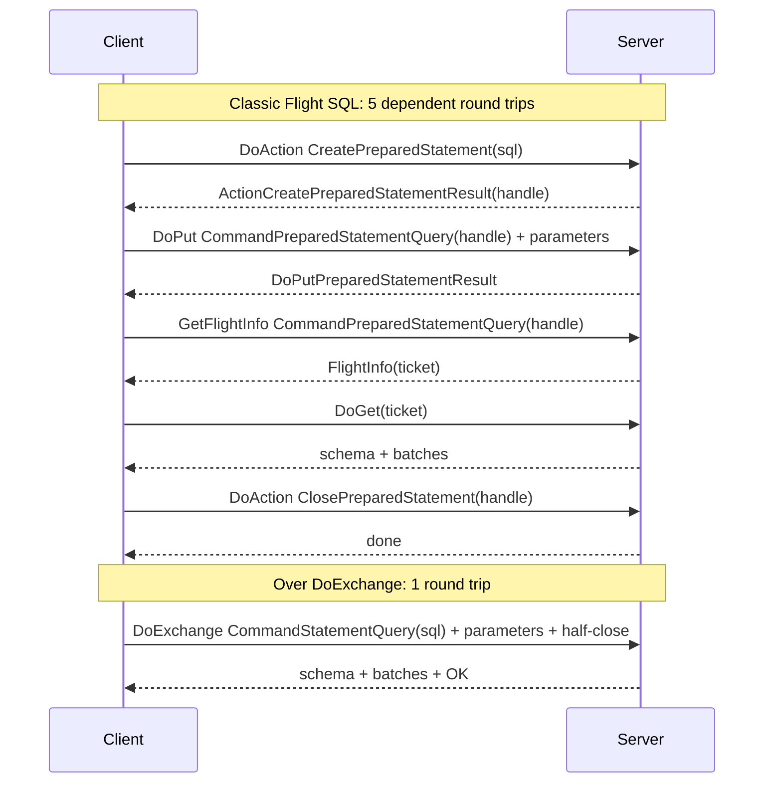
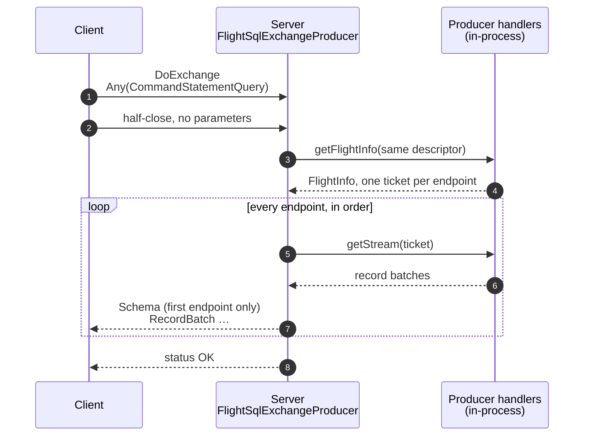
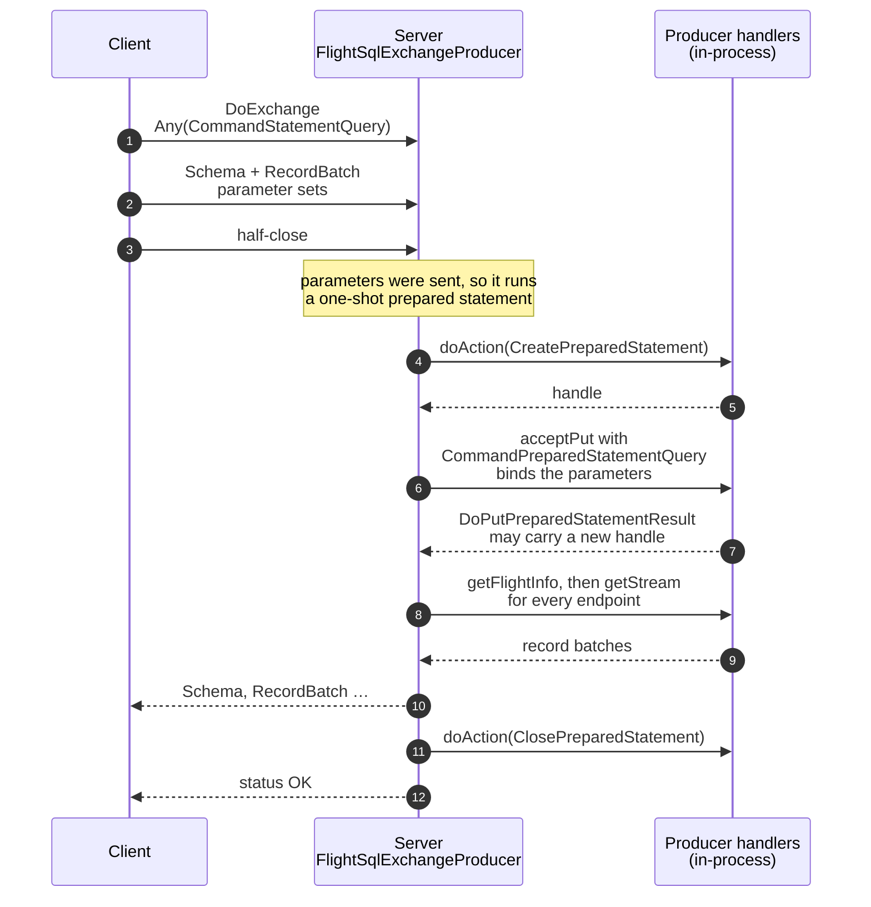
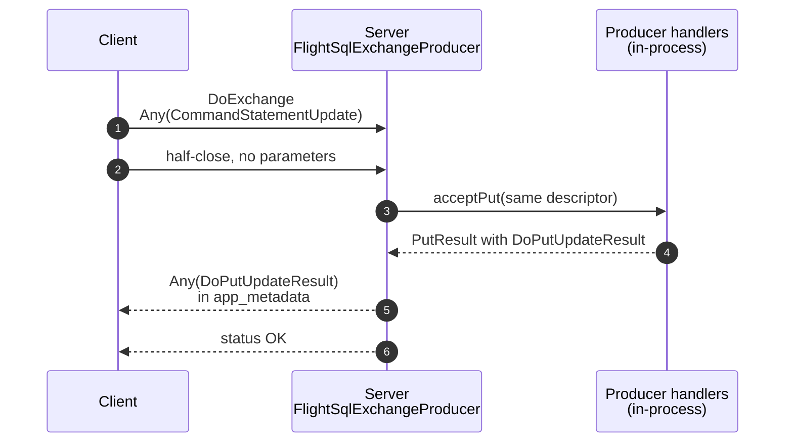
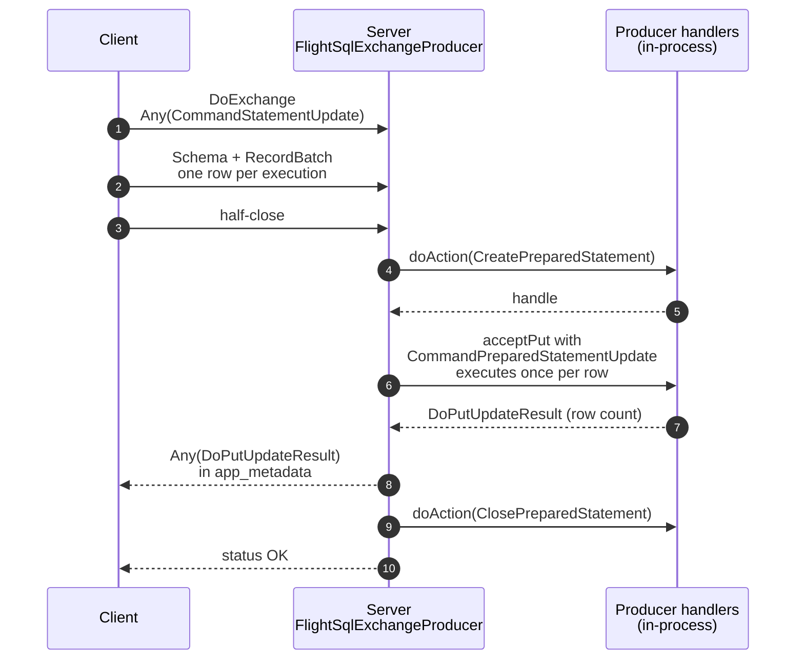
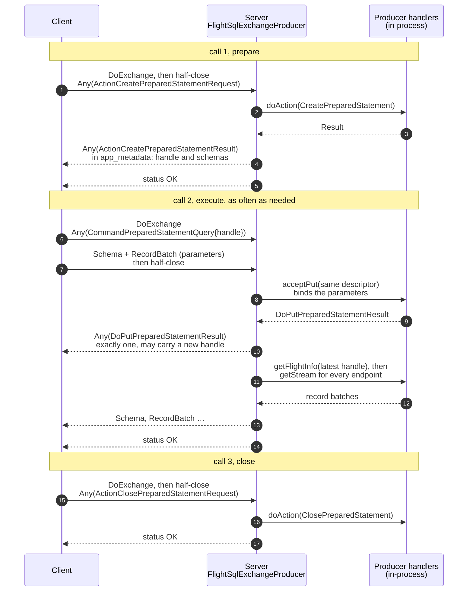
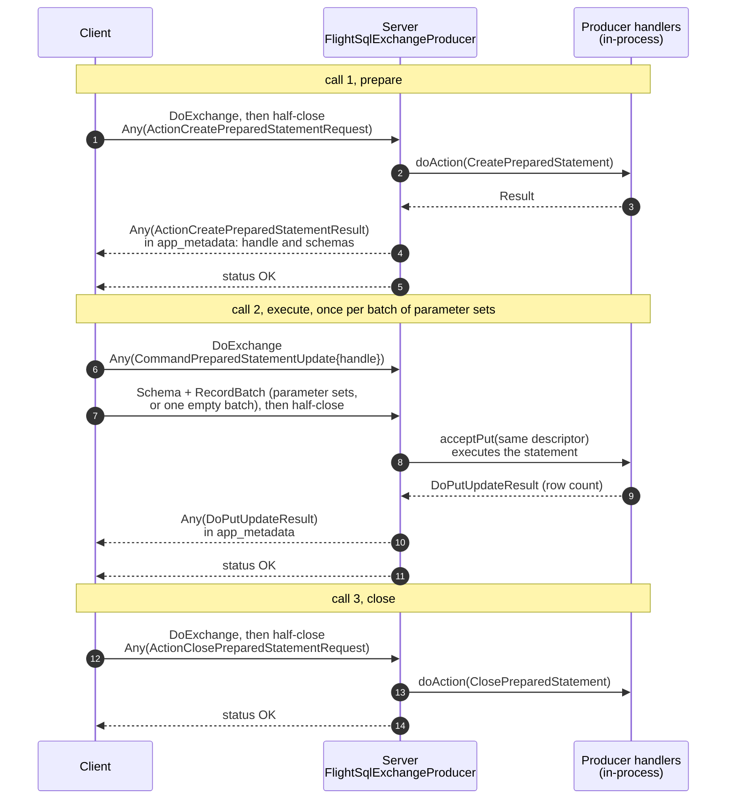
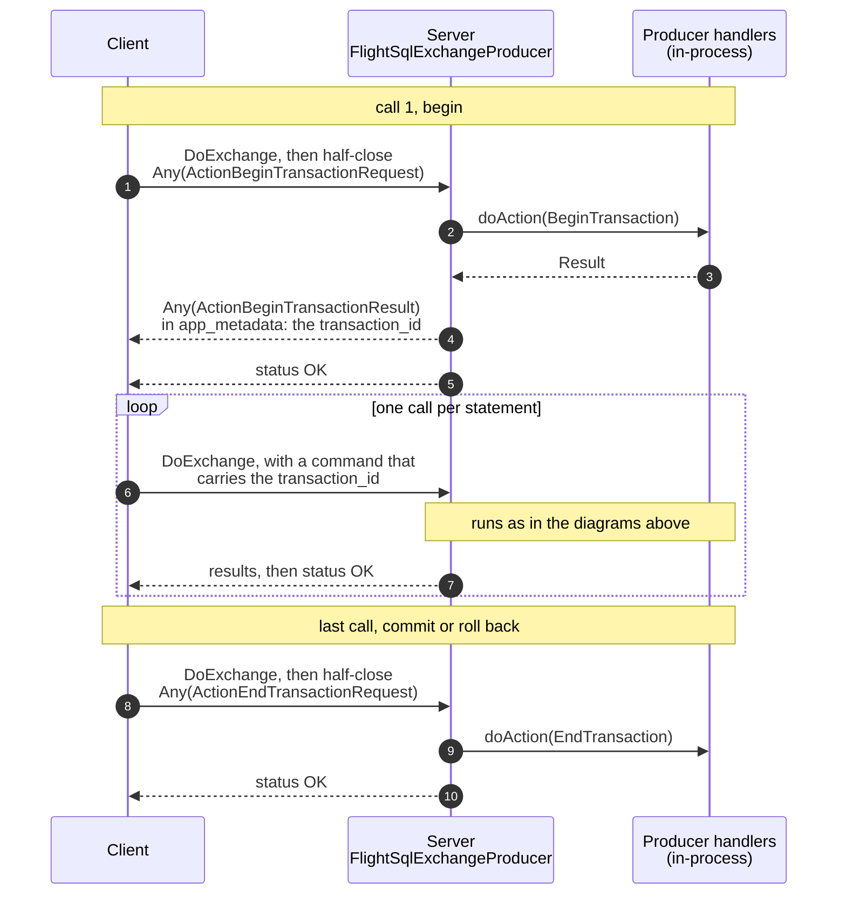
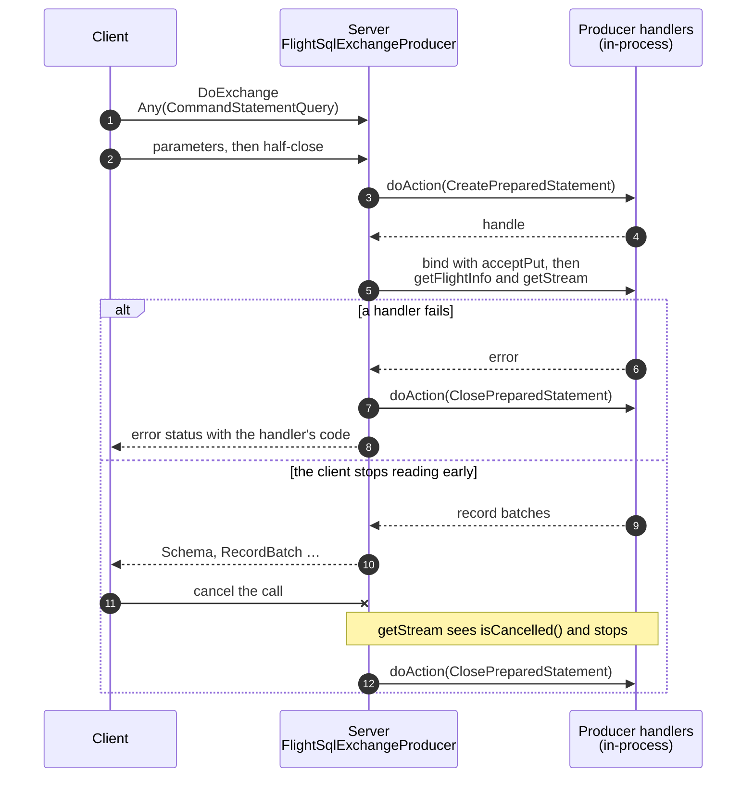

<!---
  Licensed to the Apache Software Foundation (ASF) under one
  or more contributor license agreements.  See the NOTICE file
  distributed with this work for additional information
  regarding copyright ownership.  The ASF licenses this file
  to you under the Apache License, Version 2.0 (the
  "License"); you may not use this file except in compliance
  with the License.  You may obtain a copy of the License at

    http://www.apache.org/licenses/LICENSE-2.0

  Unless required by applicable law or agreed to in writing,
  software distributed under the License is distributed on an
  "AS IS" BASIS, WITHOUT WARRANTIES OR CONDITIONS OF ANY
  KIND, either express or implied.  See the License for the
  specific language governing permissions and limitations
  under the License.
-->

# Flight SQL over a single DoExchange call (exploration)

**Status:** experimental prototype and design notes, not part of the Flight SQL specification.

## Summary

Flight SQL defines its commands (`CommandStatementQuery`, `CommandPreparedStatementUpdate`, ...)
for use with `GetFlightInfo`, `DoGet`, `DoPut` and `DoAction`. A single statement often needs
several of those calls one after the other: 2 for a query, 5 for a query with parameters. This
exploration drops all of them in favour of `DoExchange`, a bidirectional stream, and sends the
**same Flight SQL messages** over it:

- The client opens `DoExchange` with the Flight SQL command as the descriptor. If the statement has
  parameters (or data to ingest), it streams them on the same call, then half-closes.
- The server answers on the same call with the result set and/or the usual Flight SQL result
  messages (`DoPutUpdateResult`, ...), carried in `app_metadata`.

Results of the prototype in this branch:

- **Every statement takes exactly one RPC and one round trip.** This covers SELECT, INSERT,
  UPDATE, DELETE, statements with parameters, prepared statements, catalog metadata, bulk ingest
  and transactions. The tests check it by counting the RPCs the server receives.
- **Latency follows the RPC count.** At 50 ms RTT, a parameterized SELECT drops from 270 ms to
  55 ms, re-executing a prepared SELECT from 160 ms to 54 ms, and a batched INSERT from 163 ms to
  57 ms (see [Measurements](#measurements)).
- **Existing servers need no new handler code.** `FlightSqlExchangeProducer` wraps any Flight SQL
  producer and translates each exchange into in-process calls to its existing `getFlightInfo`,
  `getStream`, `acceptPut` and `doAction` handlers. Classic clients keep working unchanged: the
  whole `TestFlightSql` suite passes against the wrapped server.
- **It works with stock Flight clients.** A pyarrow (C++) client using protobuf classes generated
  from the official `FlightSql.proto` ran every scenario against the Java server.
- **The unit of an exchange is one statement, not one session.** Every Flight implementation tested
  carries at most one Arrow schema per direction per stream. Running many statements with
  different result schemas over a single long-lived call would need changes to the Flight
  implementations themselves; see [One exchange per session?](#one-exchange-per-session).

Prior art: [apache/arrow#37741](https://github.com/apache/arrow/issues/37741) proposes using
`DoExchange` to bind parameters and execute prepared statements in one round trip. The issue is
still open, and it names the main trade-off: the results come back from the server that received
the call. The [DuckDB Airport extension](https://airport.query.farm/) already uses `DoExchange`
for INSERT, UPDATE and DELETE.

## Where the round trips go today

HTTP/2 already multiplexes all of a client's gRPC calls over one connection. Flight SQL
therefore uses one connection, unless `FlightInfo` sends the client to other locations. The cost
of classic Flight SQL is the chain of *dependent* calls: each call needs the answer of the
previous one (a ticket, a handle), so each one adds a full round trip. The table shows what
`FlightSqlClient` does today; the RPC counts are the ones the tests and the benchmark record.

| Scenario | Classic Flight SQL calls | Round trips | Over DoExchange |
| --- | --- | ---: | ---: |
| SELECT | `GetFlightInfo`, `DoGet` per endpoint | 2 | 1 |
| SELECT with parameters (prepare, run once, close) | `DoAction(CreatePreparedStatement)`, `DoPut` (bind), `GetFlightInfo`, `DoGet`, `DoAction(ClosePreparedStatement)` | 5 | 1 |
| Re-execute a prepared SELECT with new parameters | `DoPut` (bind), `GetFlightInfo`, `DoGet` | 3 | 1 |
| INSERT / UPDATE / DELETE | `DoPut` | 1 | 1 |
| INSERT / UPDATE / DELETE with parameter sets | `DoAction`, `DoPut`, `DoAction` | 3 | 1 |
| Re-execute a prepared update | `DoPut` | 1 | 1 |
| Catalog metadata (`CommandGetTables`, ...) | `GetFlightInfo`, `DoGet` | 2 | 1 |
| Bulk ingest | `DoPut` | 1 | 1 |
| Begin / commit / rollback | `DoAction` | 1 each | 1 each |

Splitting a statement across calls has two more costs, beyond latency:

- **State between calls.** An L7 load balancer can route each call to a different server, so the
  prepared statement, the bound parameters and the query behind a ticket must be shared between
  servers, or pinned with sticky routing. Stateless servers work around it by encoding the bound
  parameters in the prepared-statement handle, which is why `DoPutPreparedStatementResult` exists
  ([apache/arrow#37720](https://github.com/apache/arrow/issues/37720)).
- **Leaks.** A client that dies between `CreatePreparedStatement` and `ClosePreparedStatement`
  leaves the statement open until the server's timeout expires.

## The protocol

The Flight specification describes `DoExchange` as follows: "The `FlightDescriptor` is included
with the first message, as with `DoPut`. At this point, both the client and the server may
simultaneously stream data to the other side." The prototype defines a Flight SQL exchange like
this:

1. **Request.** The client calls `DoExchange` with a command `FlightDescriptor`. Its `cmd` is an
   `Any`-packed Flight SQL request: any `Command*` message, any Flight SQL `Action*Request`
   message, or a Flight `Action` (for any other action).
2. **Input.** If the statement has input, the client streams **one** Arrow stream: parameter
   values with one row per parameter set, or rows to ingest. The client must then **half-close**
   its side of the call, even when it sent nothing. For requests that may carry parameters, the
   server waits for the half-close (or the first batch) before it starts. Clients send the
   half-close right after the request, without waiting for the server, so it costs no round trip.
3. **Output.** The server replies on the same call:
   - **Metadata-only messages** whose `app_metadata` is an `Any`-packed Flight SQL result: the
     same messages classic Flight SQL returns from `DoPut` and `DoAction`.
   - For commands that produce rows, **one** Arrow stream holding the result set. The schema is
     always sent, even for an empty result. All endpoints of the underlying `FlightInfo` are
     concatenated in order.
   - The **call status**: OK means the statement succeeded. Errors use the same status codes as
     classic Flight SQL.

| Request in the descriptor | Client streams | Server replies | Replaces |
| --- | --- | --- | --- |
| `CommandStatementQuery` | nothing | result set | `GetFlightInfo` + `DoGet` |
| `CommandStatementQuery` | parameters | result set | `DoAction` + `DoPut` + `GetFlightInfo` + `DoGet` + `DoAction` |
| `CommandStatementUpdate` | nothing | `DoPutUpdateResult` | `DoPut` |
| `CommandStatementUpdate` | parameters (one execution per row) | `DoPutUpdateResult` (one or more; the client adds them up) | `DoAction` + `DoPut` + `DoAction` |
| `CommandStatementIngest` | rows to ingest | `DoPutUpdateResult` | `DoPut` |
| `ActionCreatePreparedStatementRequest` | nothing | `ActionCreatePreparedStatementResult` | `DoAction` |
| `CommandPreparedStatementQuery` | parameters, optional | exactly one `DoPutPreparedStatementResult` if parameters were sent, then the result set | `DoPut` + `GetFlightInfo` + `DoGet` |
| `CommandPreparedStatementUpdate` | parameters (or one empty batch) | `DoPutUpdateResult` | `DoPut` |
| `ActionClosePreparedStatementRequest` | nothing | nothing | `DoAction` |
| `CommandGet*`, `CommandStatementSubstraitPlan` | nothing | result set | `GetFlightInfo` + `DoGet` |
| `ActionBeginTransactionRequest`, `ActionEndTransactionRequest`, savepoints | nothing | `ActionBeginTransactionResult`, ... | `DoAction` |
| Flight `Action` (for example `SetSessionOptions`) | nothing | each result body | `DoAction` |

A few rules make the stream unambiguous:

- **Parameters are present if and only if the client sent a schema with at least one field.** The
  classic protocol encodes intent in the choice of RPC; here the intent has to come from the
  request and its input.
- **Parameters on plain statements.** `CommandStatementQuery` and `CommandStatementUpdate` accept
  parameters, which classic Flight SQL only allows on prepared statements. The server prepares the
  statement, binds the parameters, executes it and closes it within the call. It closes the
  statement even if execution fails or the client cancels.
- **Binding a prepared query.** `CommandPreparedStatementQuery` with parameters is answered with
  exactly one `DoPutPreparedStatementResult` before the result set, so the client knows how many
  metadata messages to read. If the server returned a new handle (for example a stateless server
  that encodes the parameters in it), the message carries it and the client uses it from then on,
  as the specification requires.
- **Cancellation** is gRPC cancellation of the call. `CancelFlightInfo` is not needed, since there
  is no `FlightInfo`.

### Walkthroughs

A SELECT with one parameter, in classic Flight SQL and over DoExchange:



The diagrams follow each scenario message by message. **Client** and **Server** talk over one
`DoExchange` call, which is all the network carries. The third column stands for the producer's
existing Flight SQL handlers (`getFlightInfo`, `getStream`, `acceptPut`, `doAction`), which
`FlightSqlExchangeProducer` calls in-process. Solid arrows are requests and calls, dotted arrows are
replies, and the numbers give the order. `Any(X)` is an `Any`-packed `X`; on the arrow that opens a
call, it is the command in the call's descriptor.

#### SELECT, plain statement



Only steps 1, 2, 7 and 8 cross the network. In classic Flight SQL, steps 3 and 5 are separate RPCs,
`GetFlightInfo` and then `DoGet`, and `DoGet` has to wait for the ticket. Here the endpoints reach
the client in order, as one stream with one schema.

#### SELECT with parameters



The client sends the query, the parameters and the half-close without waiting for a reply. Steps 4
to 9 and step 11 stay inside the server. In classic Flight SQL they are five dependent RPCs:
`CreatePreparedStatement`, `DoPut`, `GetFlightInfo`, `DoGet` and `ClosePreparedStatement`.

#### INSERT / UPDATE / DELETE, plain statement



Classic Flight SQL also needs a single `DoPut` call here, so this case saves nothing, but it lets a
client send every statement through the same RPC.

#### INSERT / UPDATE / DELETE with parameter sets



Each row of the batch is one execution of the statement. Steps 4 to 7 and step 9 stay inside the
server. In classic Flight SQL they are three dependent RPCs: `CreatePreparedStatement`, `DoPut` and
`ClosePreparedStatement`.

#### Prepared SELECT, reused



The client keeps the handle and repeats call 2 as often as it needs, one round trip each time. With
parameters, classic Flight SQL needs three dependent RPCs per execution: `DoPut`, `GetFlightInfo`
and `DoGet`. If step 10 carries a new handle, the client uses it from then on. Without parameters
the client sends only the half-close in step 7, and steps 8 to 10 are skipped.

#### Prepared INSERT / UPDATE / DELETE, reused



Call 2 does the work of the classic `DoPut`, one round trip either way. Without parameters the
client sends one empty batch, as the classic Java client does.

#### Transactions



`BeginTransaction` and `EndTransaction` take one call each, and every statement in between carries
the `transaction_id` in its command, exactly as in classic Flight SQL. A transaction of *n*
statements therefore takes *n* + 2 calls. Classic Flight SQL takes more whenever a statement is a
query or has parameters.

#### Failure and cancellation



The server closes the one-shot prepared statement on every path. If a handler fails, the client gets
the same status code as in classic Flight SQL. If the client cancels, a `getStream` handler that
checks `isCancelled()` can stop early, and the statement is still closed. The handle never leaves
the server, so a client that dies cannot leak the statement.

## Measurements

`TestFlightSqlExchange` checks every scenario above against the Derby-backed `FlightSqlExample`:
the exchange result equals the classic one, and the server receives exactly one `DoExchange`
call per statement.

`TestFlightSqlExchangeLatency` is a manual benchmark. The client reaches the server through a TCP
proxy that delays each direction by half the RTT, which models network latency without limiting
bandwidth. The table shows the median of 15 runs (21 at RTT 0) on loopback with the Derby example
server.

| Scenario | Classic RPCs | Classic, RTT 0 | Exchange, RTT 0 | Classic, RTT 20 ms | Exchange, RTT 20 ms | Classic, RTT 50 ms | Exchange, RTT 50 ms |
| --- | --- | ---: | ---: | ---: | ---: | ---: | ---: |
| SELECT, statement | 2 | 8.0 ms | 3.9 ms | 49.1 ms | 24.7 ms | 109.9 ms | 55.5 ms |
| SELECT with a parameter | 5 | 11.2 ms | 4.4 ms | 116.6 ms | 24.3 ms | 269.6 ms | 55.1 ms |
| Re-execute prepared SELECT | 3 | 5.8 ms | 3.5 ms | 68.7 ms | 23.1 ms | 160.0 ms | 53.5 ms |
| INSERT, 10 parameter sets | 3 | 10.7 ms | 7.0 ms | 72.7 ms | 27.8 ms | 163.3 ms | 56.8 ms |
| UPDATE, statement | 1 | 2.1 ms | 1.9 ms | 23.4 ms | 23.4 ms | 53.3 ms | 53.9 ms |
| GetTables | 2 | 5.6 ms | 2.5 ms | 46.8 ms | 24.6 ms | 109.2 ms | 55.2 ms |

Classic latency is roughly the RPC count times the RTT; exchange latency is about one RTT in
every scenario. A single `DoPut` UPDATE was already one call and does not change. Even on
loopback, where network latency is negligible, the exchange path is not slower: skipping the
extra calls outweighs the adapter's work.

To reproduce:

```
mvn -pl flight/flight-sql test -Dtest=TestFlightSqlExchangeLatency \
    -Darrow.flight.sql.exchange.benchmark=true -DrttMs=50 -Druns=15
```

**Interoperability.** A pyarrow 25.0.1 (C++) client ran the same scenarios against the Java
server, using only `pyarrow.flight` and protobuf classes generated from `FlightSql.proto`: SELECT,
SELECT with a parameter, INSERT, UPDATE and DELETE with parameter sets, `CommandGetTables`, and a
reusable prepared statement executed twice. The server received 12 `DoExchange` calls and nothing
else. The core of such a client:

```python
request = any_pb2.Any()
request.Pack(FlightSql_pb2.CommandStatementQuery(query="SELECT * FROM intTable WHERE id = ?"))
writer, reader = client.do_exchange(flight.FlightDescriptor.for_command(request.SerializeToString()))
writer.begin(parameters.schema)
writer.write_batch(parameters)
writer.done_writing()  # half-close: the server now has the whole statement
# then read_chunk() until StopIteration: data chunks are the result set,
# metadata-only chunks are Any-packed Flight SQL results
```

## The prototype

### Server: `FlightSqlExchangeProducer`

```java
FlightServer server =
    FlightServer.builder(allocator, location, new FlightSqlExchangeProducer(producer, allocator))
        .build()
        .start();
```

The class is a `FlightProducer` decorator. It forwards every RPC to the wrapped producer and
implements `doExchange` for Flight SQL requests; any other exchange also goes to the wrapped
producer. Each exchange becomes in-process calls to the producer's existing handlers. Three
pieces make that possible:

- **Inbound view.** Handlers written for `DoPut` read the client's data from a `FlightStream`
  until it ends, and dispatch on `flightStream.getDescriptor()`. A small `FlightStream` subclass
  wraps the exchange's inbound stream. It reports the descriptor of the in-process call (for
  example `CommandPreparedStatementUpdate{handle}` in a one-shot update) and replays the first
  message, which the adapter reads ahead to find out whether parameters were sent. It never closes
  the underlying stream.
- **Result-set forwarder.** A handler written for `DoGet` calls `start(root)` and then
  `putNext()`. Some handlers call `start()` more than once: `FlightSqlStatelessExample` does it
  once per parameter row. A `FlightInfo` can also have several endpoints. The exchange can only
  carry one schema, so the forwarder binds its own root to the exchange writer and loads each
  incoming batch into it with `VectorLoader`. That shares the buffers without copying. The
  forwarder allocates in the root of the handler's allocator tree, which outlives any per-stream
  child allocator, and copies values only when a batch comes from a different tree. The schema is
  sent even when no endpoint produces data.
- **One-shot statements.** A `CommandStatementQuery` or `CommandStatementUpdate` with parameters
  is composed from the producer's own prepared-statement handlers: `CreatePreparedStatement`,
  bind (or execute the update), stream the results, then `ClosePreparedStatement`. The close runs
  on success, on failure and on cancellation.

### Client: `FlightSqlExchangeClient`

```java
try (FlightSqlExchangeClient client =
    new FlightSqlExchangeClient(FlightClient.builder(allocator, location).build())) {
  // SELECT: one call; the results arrive on it.
  try (FlightStream results = client.execute("SELECT * FROM intTable")) {
    while (results.next()) { /* results.getRoot() */ }
  }
  // Parameters without an explicit prepared statement: still one call.
  try (FlightStream results = client.execute("SELECT * FROM intTable WHERE id = ?", ids)) { ... }
  long inserted = client.executeUpdate("INSERT INTO intTable (keyName, value) VALUES (?, ?)", rows);
  long deleted = client.executeUpdate("DELETE FROM intTable WHERE keyName = ?", keys);
  // Reusable prepared statement: one call to prepare, one per execution, one to close.
  try (FlightSqlExchangeClient.PreparedStatement statement =
      client.prepare("SELECT * FROM intTable WHERE id = ?")) {
    try (FlightStream results = statement.execute(ids)) { ... }
  }
  // Catalog metadata, ingest, transactions, arbitrary actions.
  try (FlightStream tables = client.executeCommand(CommandGetTables.getDefaultInstance())) { ... }
}
```

### Tests

- `TestFlightSqlExchange` runs every scenario against the Derby example, comparing results and
  RPC counts with the classic client. It also covers:
  - error codes, which match classic Flight SQL;
  - cleanup of the one-shot prepared statement after a failed execution;
  - transaction and generic actions;
  - pass-through of non-Flight-SQL exchanges;
  - a stateless server that returns updated handles;
  - multiple and zero endpoints, and cancellation;
  - leak checks on the producer's allocators.
- `TestFlightSqlThroughExchangeProducer` runs the whole classic `TestFlightSql` suite against the
  decorated server.
- `TestFlightSqlExchangeLatency` is the opt-in benchmark above.

### Found along the way

- **Java `FlightStream` cannot survive a schema change.** It applies schema messages as soon as
  they arrive on the gRPC thread, ahead of the batches still queued for the reader. A second
  schema therefore breaks even the first result set: when a server sent an `int` batch followed by
  a `utf8` schema, the client failed on the *first* `next()` with `no more buffers for field b:
  Utf8`.
- **`FlightSqlStatelessExample` sends several schemas on one `DoGet`.** Its
  `getStreamPreparedStatement` calls `listener.start()` once per parameter row, so a classic
  `DoGet` with more than one parameter row carries several schema messages. The exchange
  forwarder merges them into one result set.
- **`FlightStreamUtils.getResults` (test utility) assumes a single batch.** For streams with more
  than one batch, it appends the rows of later batches to the first rows.
- **`FlightSqlExample` leaks memory, and existing tests hide it.** Its `DoGet` handlers never close
  the `ArrowRecordBatch` they unload, so its allocator reports a leak on close. The existing tests
  never close the producer, which hides this. The example also uses the SQL text as the
  prepared-statement handle, so preparing the same SQL twice makes both statements share, and
  invalidate, one handle.

### Limitations of the prototype

- **No update intent for Substrait.** `CommandStatementSubstraitPlan` runs as a query, and
  "schema only, do not execute" (`GetSchema`) cannot be expressed. Classic Flight SQL encodes
  both intents in the choice of RPC; a specification would need an explicit field, or dedicated
  commands.
- **No fan-out.** All endpoints are served inline by the server that received the call (see
  below).
- **One bind per exchange.** Each execution of a reusable prepared statement is its own exchange.
- **Dictionary encoding.** Dictionary-encoded result sets made of several streams are rejected.
- **No discovery.** Clients learn that a server does not support this from `UNIMPLEMENTED`.
- **Blocking waits.** Like classic `DoPut` handlers, the adapter blocks a server executor thread
  while it waits for asynchronous handlers.

## Trade-offs

What a statement-scoped exchange gains:

- **One round trip per statement**, whatever the statement, and fewer calls to authenticate,
  intercept and log.
- **Affinity for free.** A statement's whole lifecycle stays on the server that received the call,
  so prepared statements with parameters work behind any load balancer. The server needs no shared
  state and no parameters encoded in handles.
- **Pipelining.** The client sends the parameters with the request, without waiting for
  `CreatePreparedStatement` to answer.
- **Automatic cleanup.** Implicit resources are released when the call ends, including when the
  client disappears.
- **Portability.** It fits the existing Flight implementations as they are: one schema per
  direction, standard `FlightData` messages, standard status codes.

What it gives up, and how to get it back when needed:

- **Parallel and distributed fetch.** `FlightInfo` can point the client at several endpoints and
  locations, to fetch in parallel or from other nodes. Over an exchange, the results stream from
  the server that received the call. Engines that rely on fan-out could answer an exchange with
  the `FlightInfo` itself, as a metadata message the client then fetches with `DoGet` (not
  implemented here). Alternatively, the client can use classic `GetFlightInfo` for those queries.
- **Two-phase execution.** With `GetFlightInfo`, a client can inspect the schema and the estimated
  size before fetching, poll long-running queries (`PollFlightInfo`), and retry a failed `DoGet`
  on an endpoint that has not expired. An exchange re-executes on retry, and it would need a
  progress message to replace polling.
- **Blocking on the half-close.** Servers must wait for the half-close before starting commands
  that may carry parameters. Clients that forget to half-close stall until their deadline.

## One exchange per session?

The natural next step is a single long-lived exchange for a whole session, with commands flowing
back and forth, much like a PostgreSQL connection. It would allow pipelining dependent statements
(`BEGIN; INSERT; UPDATE; COMMIT` in one round trip) and would pin the whole session to one server.
It does not work on top of today's Flight implementations.

**Schemas.** Consecutive statements have different result and parameter schemas, but an Arrow IPC
stream has exactly one schema, and the Flight specification says nothing about resetting it
within a call. What the implementations do today:

| Implementation | Second schema on one stream |
| --- | --- |
| Java `FlightStream` (reader) | Corrupts the stream, including the result set that was still being read (see above) |
| C++ / pyarrow 25.0.1 writer | Rejected: `This writer has already been started`; a batch with another schema fails with `Tried to write record batch with different schema` |
| C++ / pyarrow 25.0.1 reader | Error: `Header-type of flatbuffer-encoded Message is not RecordBatch` |
| Rust `arrow-flight`, `FlightDataDecoder` (low-level) | Supported: "The schema is (re-)set. Dictionaries are cleared" |
| Rust `arrow-flight`, `FlightRecordBatchStream` | Error: `Unexpectedly saw multiple Schema messages in FlightData stream` |
| Go | Not tested |

**Other blockers:**

- **Errors.** The gRPC status ends the call, so in a session a failed statement would end the
  whole session. Errors would have to become in-band messages, with a rule for the statements that
  were already pipelined behind the failed one. PostgreSQL's pipeline mode skips everything until
  the next sync point.
- **Framing.** Each statement's input and output needs explicit "end of parameters" and "end of
  result" markers, because a call can only be half-closed once. That rules out reusing `DoPut`
  handlers that read until the end of the stream, unless they get delimited views like the one in
  this prototype.
- **Operations.** A long-lived call interacts badly with L7 proxies: idle timeouts, and maximum
  connection age, whose `GOAWAY` ends the session. Deadlines and authentication headers apply to
  the whole call rather than to each statement, so an expired token cannot be refreshed. Metrics
  and traces see a single RPC. A large result set blocks every statement queued behind it, unless
  results are multiplexed with request ids. And the server holds a thread for the whole session.
- **Workaround.** Tunnelling each result set as an IPC stream inside `app_metadata` works
  everywhere, but it copies every buffer and bypasses Flight's zero-copy body path. It is only
  acceptable for small results.

Most of the latency win comes from the statement-scoped exchange. A session-scoped exchange adds
pipelining of *dependent* statements and affinity, but it needs a change to the Flight
specification: schema resets, or an explicit end-of-IPC-stream marker in `DoExchange`. It also
needs matching reader changes in each implementation, plus in-band errors. One intermediate
option would fit today's implementations: DML and transaction commands only return metadata. A
"batch" request carrying several such commands, without parameters or with parameters that share
one schema, could therefore run a whole write transaction in one exchange within the one-schema
rule. That would need one new message.

## Possible next steps

1. **Specification.** Propose "Flight SQL over DoExchange" as an optional part of Flight SQL,
   starting from the request table and rules above. It would need:
   - a `SqlInfo` value so that clients can discover support;
   - explicit intents for a Substrait update and for schema-only requests.

   The discussion could continue on [apache/arrow#37741](https://github.com/apache/arrow/issues/37741)
   and the dev@ list, with the numbers above.
2. **Java.** Make the adapter the default `doExchange` of `FlightSqlProducer`, so that every Java
   Flight SQL server supports it. Add exchange-based methods, with fallback, to `FlightSqlClient`.
   Let the JDBC driver use them for `PreparedStatement.executeQuery` with parameters, which today
   costs 5 round trips.
3. **Other implementations.** C++, Go and Rust servers can use the same mapping onto their
   existing handlers: it only needs one schema per direction.
4. **Fan-out.** Prototype the "answer with a `FlightInfo`" mode for engines that return several
   endpoints.
