<!---
  Licensed to the Apache Software Foundation (ASF) under one
  or more contributor license agreements.  See the NOTICE file
  distributed with this work for additional information
  regarding copyright ownership.  The ASF licenses this file
  to you under the Apache License, Version 2.0 (the
  "License"); you may not use this file except in compliance
  with the License.  You may obtain a copy of the License at

    http://www.apache.org/licenses/LICENSE-2.0

  Unless required by applicable law or agreed to in writing,
  software distributed under the License is distributed on an
  "AS IS" BASIS, WITHOUT WARRANTIES OR CONDITIONS OF ANY
  KIND, either express or implied.  See the License for the
  specific language governing permissions and limitations
  under the License.
-->

# Flight SQL over DoExchange: protocol proposal

**Status:** draft proposal for discussion. It is not part of the Flight SQL specification. The key
words MUST, MUST NOT, SHOULD and MAY are to be interpreted as described in
[RFC 2119](https://www.rfc-editor.org/rfc/rfc2119).

## Summary

Flight SQL spreads one statement over several dependent RPCs: two for a query, five for a query
with parameters. This proposal lets a client run **any Flight SQL request as a single `DoExchange`
call**. The request travels in the call's descriptor and its input (parameters, or rows to ingest)
follows on the same call. The server answers on the same call with the usual Flight SQL results
and the result set.

- **Nothing changes in Flight.** `DoExchange`, command descriptors and metadata-only messages
  are already part of Flight.
- **Flight SQL gains a "When used with DoExchange" mode** for its commands and actions, one
  `SqlInfo` value and one new capability: parameters on ad hoc statements. All existing messages
  are reused as they are, and the classic RPCs keep working unchanged.
- **Each request takes one round trip**, instead of up to five. At 50 ms of round-trip time, a
  SELECT with a parameter drops from 270 ms to 55 ms in the prototype.
- **The unit is one request, not one session.** An exchange for a whole session would need changes
  to Arrow IPC and to every Flight implementation, and it would not be faster.

The rules below are prototyped in Java on this branch, except the `FlightInfo` answer of R15 and
the `SqlInfo` value of R16, and an independent pyarrow (C++) client exercised them. Every message
flow in this document was checked against captured network traffic, except the one marked as not
prototyped ([Appendix B](#appendix-b-validation-of-the-message-flows)).

## Motivation

HTTP/2 already carries all of a client's gRPC calls on one connection, so classic Flight SQL
needs no extra connections. It pays for the chain of *dependent* calls instead: each call needs a
value from the previous answer (a prepared-statement handle, a ticket) before it can start, so
each one adds a full round trip.

| Scenario | Classic Flight SQL calls | Round trips | Over DoExchange |
| --- | --- | ---: | ---: |
| SELECT | `GetFlightInfo`, `DoGet` per endpoint | 2 | 1 |
| SELECT with parameters (prepare, run once, close) | `DoAction(CreatePreparedStatement)`, `DoPut` (bind), `GetFlightInfo`, `DoGet`, `DoAction(ClosePreparedStatement)` | 5 | 1 |
| Re-execute a prepared SELECT with new parameters | `DoPut` (bind), `GetFlightInfo`, `DoGet` | 3 | 1 |
| INSERT / UPDATE / DELETE | `DoPut` | 1 | 1 |
| INSERT / UPDATE / DELETE with parameter sets | `DoAction`, `DoPut`, `DoAction` | 3 | 1 |
| Re-execute a prepared update | `DoPut` | 1 | 1 |
| Catalog metadata (`CommandGetTables`, ...) | `GetFlightInfo`, `DoGet` | 2 | 1 |
| Bulk ingest | `DoPut` | 1 | 1 |
| Begin / commit / rollback | `DoAction` | 1 each | 1 each |

Splitting a statement across calls has two more costs:

- **State between calls.** An L7 load balancer can route each call to a different server. The
  prepared statement, the bound parameters and the query behind a ticket must therefore be shared
  between servers, or pinned with sticky routing. Stateless servers work around it by encoding the
  bound parameters in the handle, which is why `DoPutPreparedStatementResult` exists
  ([apache/arrow#37720](https://github.com/apache/arrow/issues/37720)).
- **Leaks.** A client that dies between `CreatePreparedStatement` and `ClosePreparedStatement`
  leaves the statement open until the server's timeout expires.

Prior art: [apache/arrow#37741](https://github.com/apache/arrow/issues/37741) proposes using
`DoExchange` to bind parameters and execute a prepared statement in one round trip. The issue is
still open, and it names the main trade-off: the results come back from the server that received
the call. The [DuckDB Airport extension](https://airport.query.farm/) already uses `DoExchange`
for INSERT, UPDATE and DELETE.

## Background

`DoExchange` is Flight's bidirectional streaming RPC. The Flight specification says: "The
`FlightDescriptor` is included with the first message, as with `DoPut`. At this point, both the
client and the server may simultaneously stream data to the other side." Every message in either
direction is a `FlightData`, with four optional parts:

- `flight_descriptor`;
- `data_header`, the header of an Arrow IPC schema, record batch or dictionary batch message;
- `data_body`, the buffers of that message;
- `app_metadata`, bytes defined by the application.

A gRPC call closes each direction separately. The client **half-closes** when it has nothing more
to send but still expects an answer. On the wire, a half-close is HTTP/2's END_STREAM flag, set
on the client's last data frame or on an empty frame sent right after it. It is not a gRPC message
and it costs no round trip. The server ends the call with its **status**, sent as gRPC trailers.
RPCs with a single request, such as `GetFlightInfo` and `DoGet`, half-close automatically. With
`DoPut` and `DoExchange`, the client decides when it has finished sending.

Flight SQL defines no RPCs of its own. Its commands are protobuf messages packed in
`google.protobuf.Any` and placed in a descriptor, a ticket or an action body. The specification
says what each command does "when used with" `GetFlightInfo`, `GetSchema` or `DoPut`, and which
requests go with `DoAction`. It never mentions `DoExchange`, so this proposal conflicts with
nothing.

## Terminology

- **Exchange:** one `DoExchange` call that carries one Flight SQL request.
- **Request:** the `Any`-packed Flight SQL message in the exchange's descriptor.
- **Input:** the Arrow IPC stream the client sends after the request: one schema, then record
  batches.
- **Result message:** a `FlightData` that has only `app_metadata` set, holding an `Any`-packed
  Flight SQL result.
- **Result stream:** the Arrow IPC stream of rows that the server sends: one schema, then record
  batches.

## Specification

### Request

**R1.** The client MUST open the exchange with a `FlightData` whose `flight_descriptor` has type
`CMD` and whose `cmd` is a `google.protobuf.Any` packing one of the requests listed in
[Requests](#requests). The server MUST take the request from the first message. Clients MAY
repeat the descriptor on the message that carries the input schema, as the Java and C++ Flight
clients do; the server MUST ignore repeated descriptors.

### Input

**R2.** After the first message, the client MAY send one input stream, and MUST NOT send more than
one. What the input holds depends on the request: parameter values with one row per parameter
set, or the rows to ingest.

**R3.** The client MUST half-close after its input, or right after the first message when it has
no input. It SHOULD send the whole request, half-close included, without waiting for the server.

**R4.** A request carries parameters if and only if its input schema has at least one field. For
requests that accept input, the server MUST read the input up to the half-close before it
executes the request.

### Output

**R5.** The server replies with zero or more result messages, then the result stream if the
request returns rows, then the status, in that order. It MUST NOT interleave result messages with
the result stream.

**R6.** Flight SQL results are the messages that classic Flight SQL returns from `DoPut` and
`DoAction`, for example `DoPutUpdateResult` and `ActionCreatePreparedStatementResult`. Over
`DoExchange` they are always `Any`-packed, including where classic `DoPut` sends them unpacked,
because an exchange's replies are not typed by the RPC. The results of other Flight actions pass
through unchanged (R14).

**R7.** A result stream is one Arrow IPC stream. The server MUST send its schema even when no rows
follow. For results that span several endpoints, see R15.

**R8.** An update returns one or more `DoPutUpdateResult` messages. The number of affected rows is
the sum of their `record_count` values, or unknown if any of them is -1.

### Status, errors and cancellation

**R9.** The status is the outcome of the request. OK means success. For a failure, the server
MUST use the status code that classic Flight SQL would return for the same request. Rows or
results received before an error status belong to a failed request. A server MAY fail a request
before the client half-closes, for example when it does not support the request.

**R10.** A client cancels a request by cancelling the call. The server MUST then stop the request
and release everything it holds for it. `CancelFlightInfo` does not apply, since the exchange
creates no `FlightInfo`.

### Parameters on ad hoc statements

**R11.** Over `DoExchange`, `CommandStatementQuery` and `CommandStatementUpdate` accept
parameters, which classic Flight SQL allows only on prepared statements. The server executes such
a request as a one-shot prepared statement: it prepares the statement, binds the parameters,
executes it and closes it within the call. An update executes once per parameter row. The handle
never reaches the client. The server MUST close the statement when the call ends, whether the
request succeeded, failed or was cancelled.

### Prepared statements

**R12.** When a `CommandPreparedStatementQuery` carries parameters, the server MUST send exactly
one `DoPutPreparedStatementResult` before the result stream, so that the client knows how many
result messages precede the rows. If that message sets `prepared_statement_handle`, the client
MUST use the new handle from then on, as with `DoPut` today. Without parameters, the server sends
no `DoPutPreparedStatementResult`.

**R13.** A `CommandPreparedStatementUpdate` executes once per parameter row. To execute a statement
that has no parameters, the client sends an input with no fields and one batch with zero rows, as
the classic Java client does with `DoPut`.

### Transactions, savepoints and other actions

**R14.** Flight SQL action requests travel in the descriptor, and each result of the action comes
back as a result message. Commands keep carrying `transaction_id` exactly as they do today. Any
other Flight action MAY be sent as an `Any`-packed `arrow.flight.protocol.Action`. The server then
runs it as `DoAction` would and returns each non-empty `Result` body, unchanged, as a result
message; the packing rule of R6 does not apply to those bodies.

### Several endpoints

**R15.** When a result spans several endpoints, the server MUST do one of two things:

- stream all of them, in order, as one result stream, since they share a single schema; or
- answer with a single result message holding an `Any`-packed `arrow.flight.protocol.FlightInfo`,
  and no result stream.

In the second case, the client fetches the endpoints with `DoGet` as in classic Flight SQL, and
keeps every `FlightInfo` feature: locations, parallel fetch, expiration, `CancelFlightInfo` and
`RenewFlightEndpoint`. Clients MUST support both answers.

### Discovery and compatibility

**R16.** A server that supports this proposal SHOULD advertise it with a new `SqlInfo` value,
`FLIGHT_SQL_SERVER_DO_EXCHANGE = true`. A server without support answers `UNIMPLEMENTED`, which
is what a Flight server does when it does not implement `DoExchange`. A client MAY try an exchange
and fall back to the classic RPCs on `UNIMPLEMENTED`; it SHOULD remember the answer for that
server. An exchange whose descriptor does not hold a Flight SQL request keeps whatever meaning the
server gives it. Flight SQL requests are recognised by their `Any` type: a message in the
`arrow.flight.protocol.sql` package, or `arrow.flight.protocol.Action`.

### Requests

| Request in the descriptor | Client input | Server output | Replaces |
| --- | --- | --- | --- |
| `CommandStatementQuery` | none, or parameters (R11) | result stream | `GetFlightInfo` + `DoGet`; with parameters, 5 calls |
| `CommandStatementSubstraitPlan` | none | result stream | `GetFlightInfo` + `DoGet` |
| `CommandStatementUpdate` | none, or parameter sets (R11) | `DoPutUpdateResult`, one or more (R8) | `DoPut`; with parameters, 3 calls |
| `CommandStatementIngest` | the rows to ingest | `DoPutUpdateResult` | `DoPut` |
| `CommandPreparedStatementQuery` | none, or parameters | with parameters, exactly one `DoPutPreparedStatementResult` (R12); then the result stream | `DoPut` + `GetFlightInfo` + `DoGet` |
| `CommandPreparedStatementUpdate` | parameter sets, or no fields and one zero-row batch (R13) | `DoPutUpdateResult`, one or more (R8) | `DoPut` |
| `CommandGetCatalogs`, `CommandGetDbSchemas`, `CommandGetTables`, `CommandGetTableTypes`, `CommandGetSqlInfo`, `CommandGetXdbcTypeInfo`, `CommandGetPrimaryKeys`, `CommandGetExportedKeys`, `CommandGetImportedKeys`, `CommandGetCrossReference` | none | result stream | `GetFlightInfo` + `DoGet` |
| `ActionCreatePreparedStatementRequest`, `ActionCreatePreparedSubstraitPlanRequest` | none | `ActionCreatePreparedStatementResult` | `DoAction` |
| `ActionClosePreparedStatementRequest` | none | nothing | `DoAction` |
| `ActionBeginTransactionRequest`, `ActionBeginSavepointRequest` | none | `ActionBeginTransactionResult`, `ActionBeginSavepointResult` | `DoAction` |
| `ActionEndTransactionRequest`, `ActionEndSavepointRequest` | none | nothing | `DoAction` |
| `arrow.flight.protocol.Action`, for any other action | none | each non-empty result body, unchanged (R14) | `DoAction` |

Where the table says "result stream", R15 also allows the server to answer with a `FlightInfo`.

## Message flows

The diagrams show only what crosses the network, between the client and the server:

- Each arrow is a message on the exchange, unless it names another RPC.
- `descriptor: Any(X)` is the first message of the call.
- `app_metadata: Any(X)` is a result message.
- `Schema` and `RecordBatch` are Arrow IPC messages.
- `half-close` is the client ending its side of the call.
- `status` is the gRPC status that ends the call.
- Notes describe what the server does; they are not messages.
- Solid arrows come from the client, dotted arrows from the server.
- Numbers give the order of the messages.

[Appendix B](#appendix-b-validation-of-the-message-flows) lists the captured traffic that each
diagram was checked against.

### Classic Flight SQL and DoExchange compared

A SELECT with one parameter:

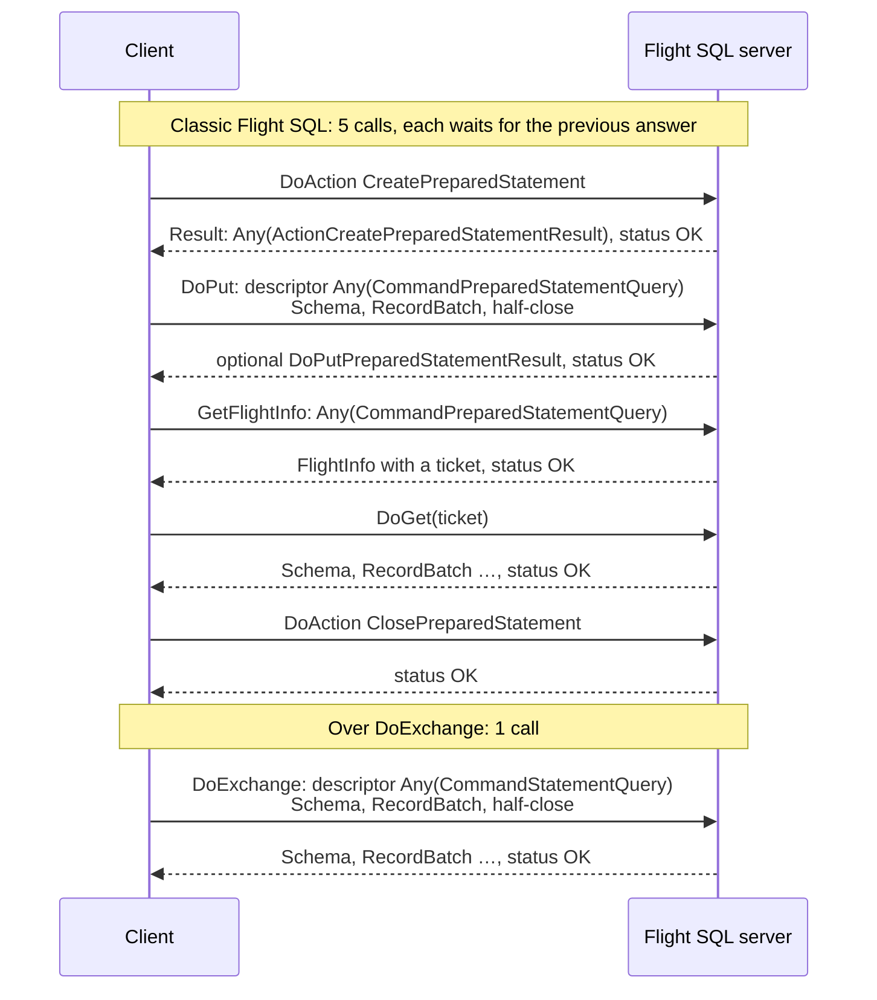

Classic calls 2 to 5 cannot start early: they need the handle from call 1, and `DoGet` needs the
ticket from `GetFlightInfo`. Over `DoExchange`, the client sends everything at once.

### SELECT

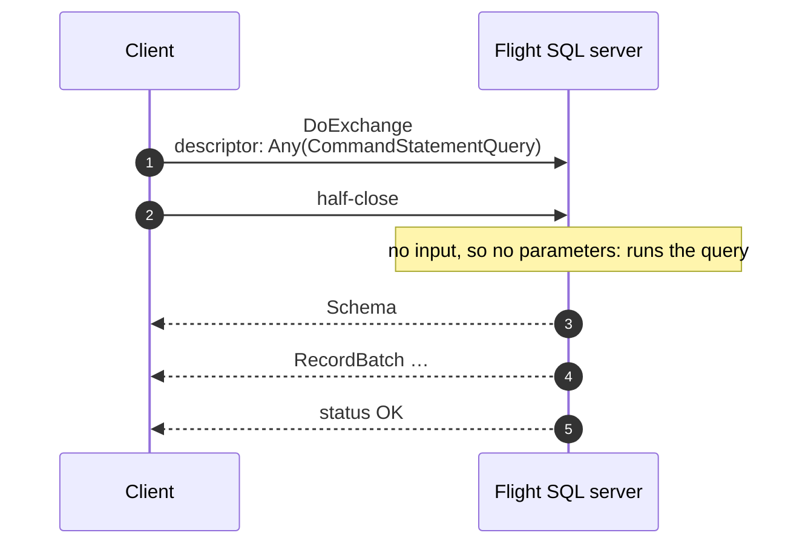

The half-close (step 2) tells the server that no parameters are coming (R4). The catalog commands
(`CommandGetTables`, ...) and `CommandStatementSubstraitPlan` follow the same flow.

### SELECT with parameters

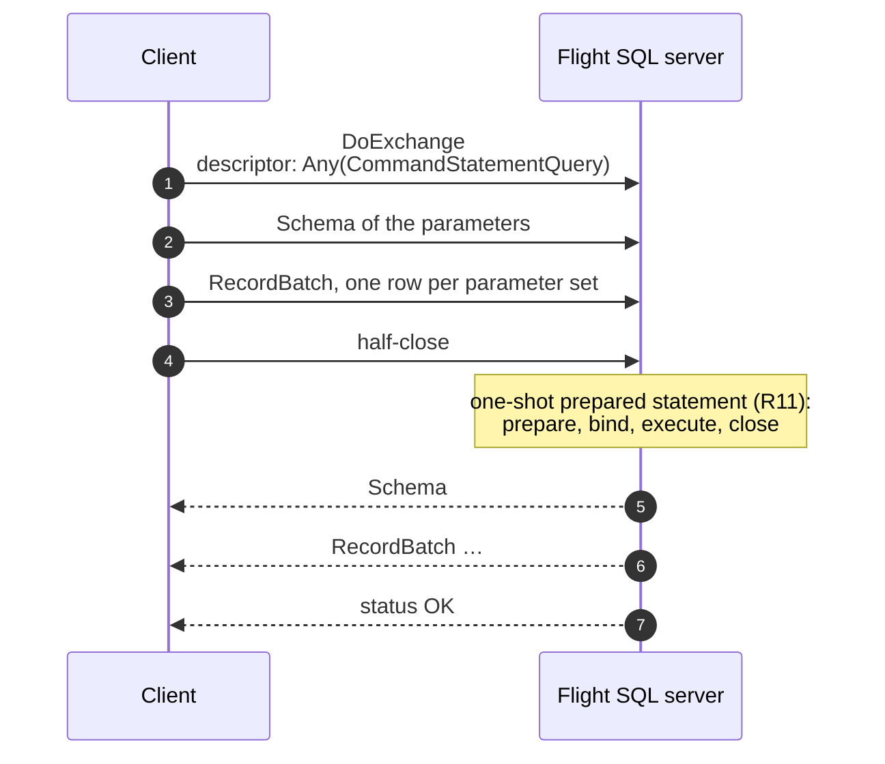

The client sends steps 1 to 4 without waiting for the server. The five classic calls become
server-internal steps.

### INSERT, UPDATE or DELETE

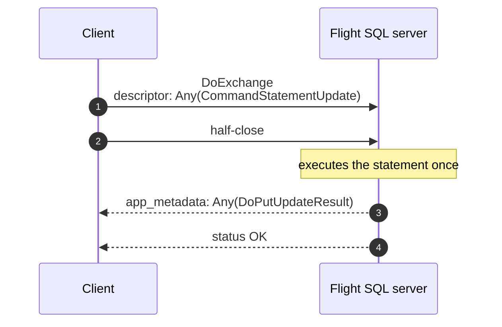

Classic Flight SQL also needs a single `DoPut` call here, so the gain is only that every request
now uses the same RPC.

### INSERT, UPDATE or DELETE with parameter sets

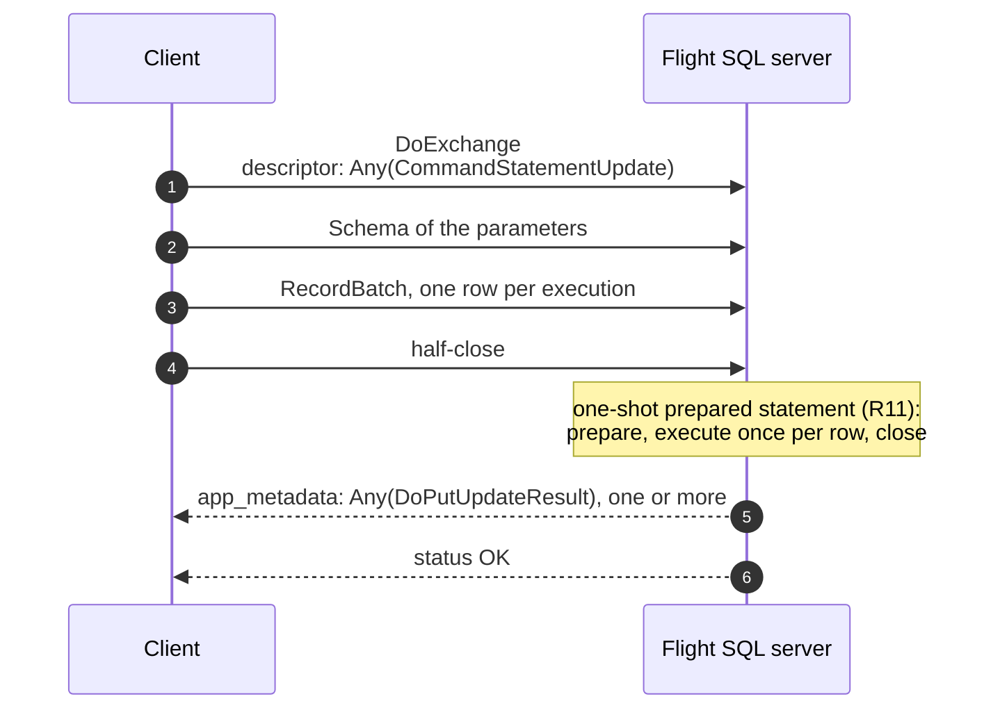

The client adds up the `record_count` values of all `DoPutUpdateResult` messages (R8).

### Prepared SELECT

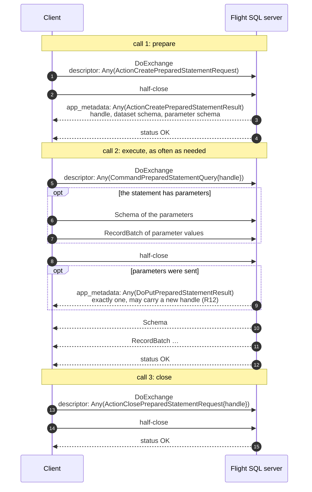

Each execution takes one round trip instead of three (`DoPut`, `GetFlightInfo`, `DoGet`). A
stateless server can return a new handle in the `DoPutPreparedStatementResult`, and the client
then uses it for later calls.

### Prepared INSERT, UPDATE or DELETE

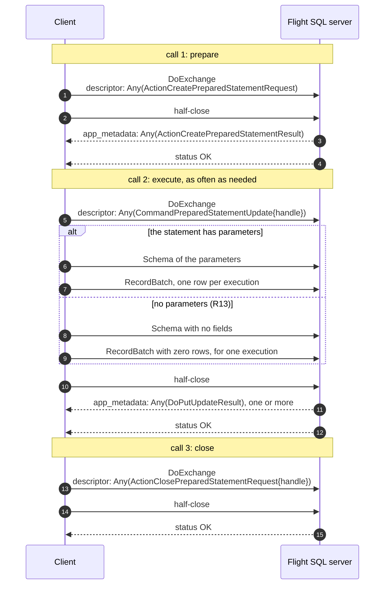

Call 2 does the work of the classic `DoPut`, in one round trip either way.

### Transactions

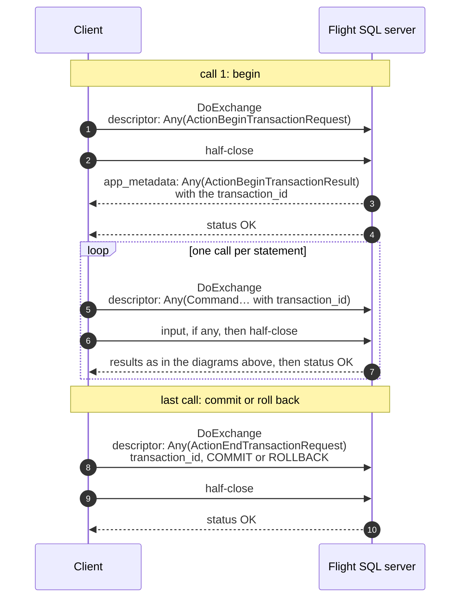

A transaction of *n* statements takes *n* + 2 calls. Classic Flight SQL takes more whenever a
statement is a query or has parameters. Savepoints work the same way.

### Errors and cancellation

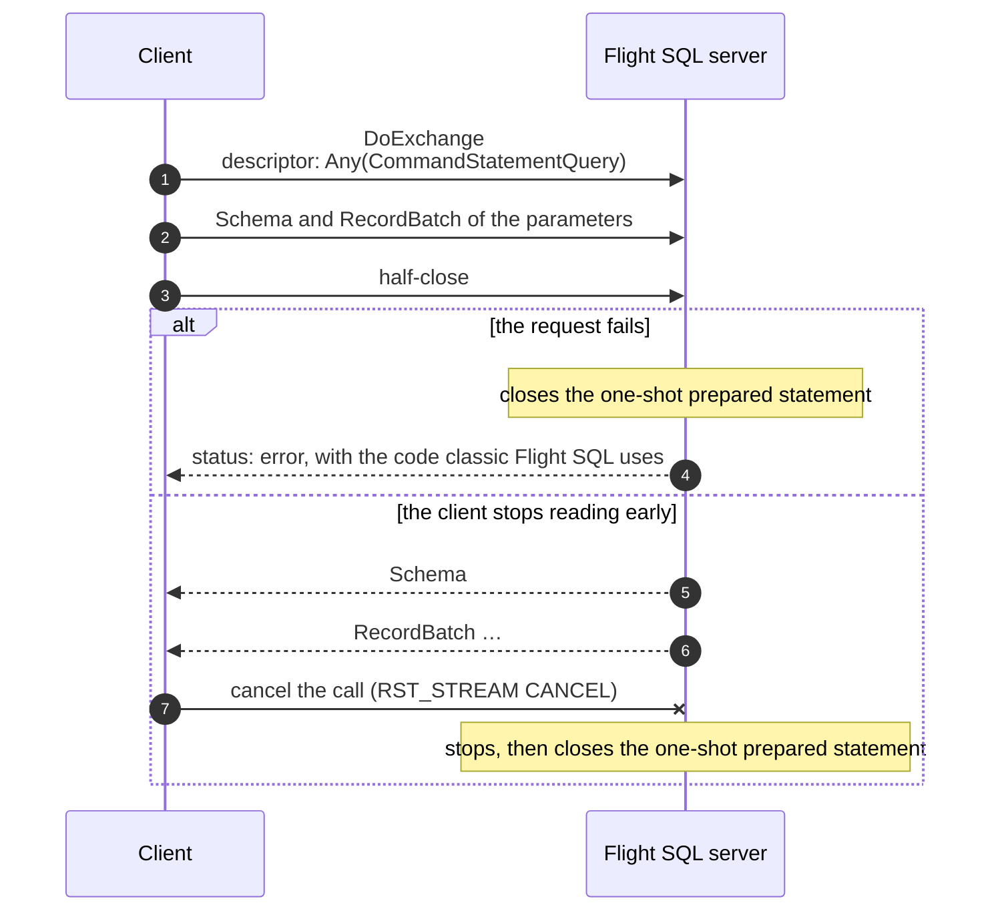

Here the failure comes before any result, so the reply is status-only (R9). A cancelled call gets
no status at all (R10). Either way the handle never left the server, so a client that disappears
cannot leak the statement.

### Results with several endpoints

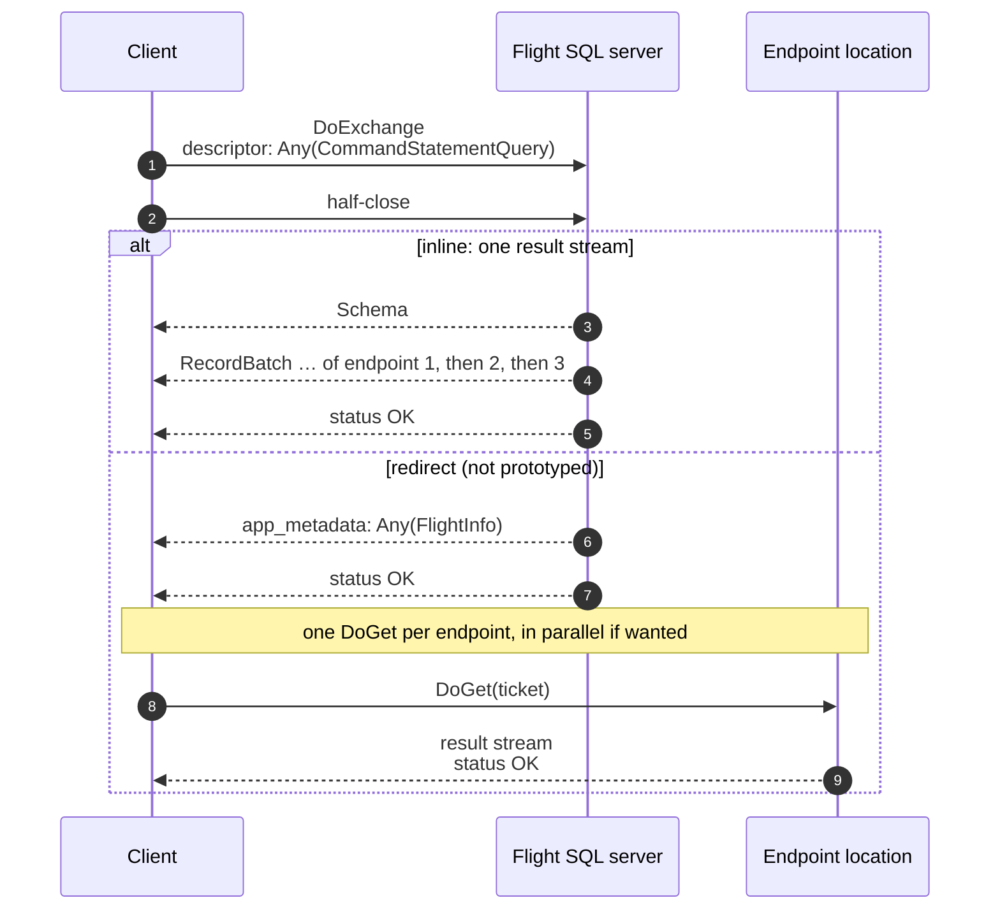

Streaming inline keeps the one round trip, but every row passes through the server that received
the call. The redirect costs a second round trip and keeps distributed and parallel fetching
(R15).

### Discovery and fallback

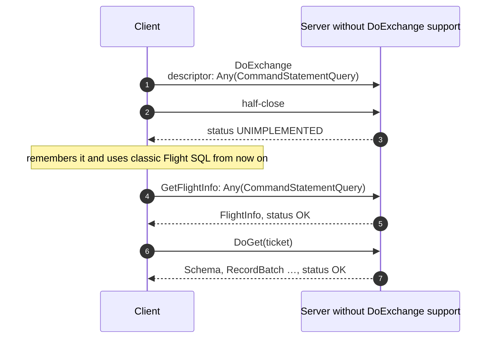

A failed probe costs one round trip, once per server (R16). A client that already reads `SqlInfo`,
as JDBC drivers do for database metadata, can check the flag instead.

## Proposed changes to the specification

Flight itself does not change. The Flight SQL changes are additive.

**`Flight.proto`, comment only.** `FlightData.flight_descriptor` says "This is only relevant when
a client is starting a new DoPut stream", but `DoExchange` uses it too:

```protobuf
  /*
   * The descriptor of the data. This is only relevant when a client is
   * starting a new DoPut or DoExchange stream.
   */
  FlightDescriptor flight_descriptor = 1;
```

**`FlightSql.proto`, a new `SqlInfo` value.** It takes the next free number in the server
information range:

```protobuf
  /*
   * Retrieves a boolean value indicating whether the Flight SQL Server accepts
   * Flight SQL requests over DoExchange.
   *
   * Returns:
   * - false: if Flight SQL requests over DoExchange are unsupported;
   * - true: if Flight SQL requests over DoExchange are supported.
   */
  FLIGHT_SQL_SERVER_DO_EXCHANGE = 12;
```

**`FlightSql.proto`, comments.** Each command's comment gains a DoExchange entry. For example:

```protobuf
/*
 * Represents a SQL query. Used in the command member of FlightDescriptor
 * for the following RPC calls:
 *  - GetSchema: return the Arrow schema of the query.
 *    ...
 *  - GetFlightInfo: execute the query.
 *  - DoExchange: execute the query and return the results on the same call.
 *    The client may first stream parameter values, one row per parameter set.
 */
message CommandStatementQuery {
```

The comments of `DoPutUpdateResult` and `DoPutPreparedStatementResult` would say that, over
DoExchange, they are returned `Any`-packed in the `app_metadata` of a metadata-only message.

**`FlightSql.rst`, a new section.** It would sit after the command list:

> **Flight SQL over DoExchange.** Any command or action request above can also be executed with a
> single DoExchange call. The request is packed into a `google.protobuf.Any`, serialized, and set
> as the `cmd` of a CMD-type FlightDescriptor sent with the first message. The client then streams
> its input, if any, as one Arrow stream, and half-closes. The server replies on the same call:
> first the Flight SQL results, each `Any`-packed in the `app_metadata` of a metadata-only
> message, then the result set, if any. The status of the call is the result of the request.
> Servers advertise support with `FLIGHT_SQL_SERVER_DO_EXCHANGE`.

The section would then state rules R1 to R16. Each command in the list would also gain a
"When used with DoExchange" line, in the same style as the existing entries:

- `CommandStatementQuery`: execute the query and return the results on the same call. The client
  may stream parameter values; the server then prepares, binds, executes and closes a prepared
  statement within the call.
- `CommandStatementUpdate`: execute the query and return the number of affected rows in one or
  more `DoPutUpdateResult` messages. If the client streams parameter sets, the statement is
  executed once per row.
- `CommandStatementIngest`: load the stream of record batches into the target table and return a
  `DoPutUpdateResult`.
- `CommandPreparedStatementQuery`: bind the parameter values the client streams, if any, and
  execute the prepared statement, returning the results on the same call. If parameters were sent,
  the server first returns exactly one `DoPutPreparedStatementResult`, which may carry an updated
  handle.
- `CommandPreparedStatementUpdate`: execute the prepared statement once per parameter row, or once
  for a batch without rows, and return the number of affected rows.
- Metadata commands and `CommandStatementSubstraitPlan`: return the results on the same call.
- Action requests: run the action; each result is returned in a metadata-only message.

## Trade-offs

What a request-scoped exchange gains:

- **One round trip per request**, whatever the request. There are also fewer calls to
  authenticate, intercept and log.
- **Affinity for free.** A statement's whole lifecycle stays on the server that received the call,
  so statements with parameters work behind any load balancer. The server needs no shared state
  and no parameters encoded in handles.
- **Automatic cleanup.** One-shot statements are released when the call ends, including when the
  client disappears.
- **Portability.** It fits the Flight implementations as they are: one schema per direction,
  standard `FlightData` messages and standard status codes.

What it gives up, and how to get it back:

- **Parallel and distributed fetch.** An inline result streams through the server that received
  the call. Engines that fan out answer with a `FlightInfo` instead (R15), or clients use classic
  `GetFlightInfo` for those queries.
- **Two-phase execution.** With `GetFlightInfo`, a client can look at the schema and the estimated
  size before fetching. It can also poll a long-running query (`PollFlightInfo`) and retry a
  failed `DoGet` on an endpoint that has not expired. An exchange re-executes on retry. The
  `FlightInfo` answer of R15 and the classic RPCs remain available for these cases.
- **Waiting for the half-close.** A server cannot run a request that may carry parameters until
  the client half-closes (R4). A client that forgets to half-close stalls until its deadline.

## Why one request per exchange, not one session

A single long-lived exchange for a whole session, with requests flowing back and forth like a
PostgreSQL connection, would let a client pipeline dependent statements (`BEGIN`, `INSERT`,
`UPDATE`, `COMMIT` in one round trip). It does not work on top of today's Flight.

**Schemas.** Consecutive statements have different parameter and result schemas. An Arrow IPC
stream has exactly one schema, and Flight does not define a way to reset it within a call. The
implementations behave as follows:

| Implementation | Second schema on one stream |
| --- | --- |
| Java `FlightStream` (reader) | Timing-dependent. The second schema is applied on the gRPC thread as soon as it arrives: the batches that follow it are loaded into a root the client never sees and are lost, or, if it overtakes batches still queued for the reader, `next()` fails on the first result set with `no more buffers for field b: Utf8` |
| C++ / pyarrow 25.0.1 writer | Rejected: `This writer has already been started`; a batch with another schema fails with `Tried to write record batch with different schema` |
| C++ / pyarrow 25.0.1 reader | Error: `Header-type of flatbuffer-encoded Message is not RecordBatch` |
| Rust `arrow-flight`, `FlightDataDecoder` (low-level) | Supported: "The schema is (re-)set. Dictionaries are cleared" |
| Rust `arrow-flight`, `FlightRecordBatchStream` | Error: `Unexpectedly saw multiple Schema messages in FlightData stream` |
| Go | Not tested |

A session-scoped exchange runs into other problems too:

- **Errors.** The status ends the call, so one failed statement would end the whole session.
  Errors would have to become in-band messages, with rules for the statements already pipelined
  behind the failed one.
- **Framing.** Each statement would need explicit end-of-input and end-of-result markers, because
  a call can be half-closed only once.
- **Operations.** A long-lived call works badly with L7 proxies, which apply idle timeouts and a
  maximum connection age (the `GOAWAY` would end the session). Deadlines and authentication headers
  would apply to the whole session, so an expired token could not be refreshed. Metrics and traces
  would see a single RPC. A large result would block every statement queued behind it.
- **No latency gain.** A new call on an open HTTP/2 connection costs no round trip of its own, so a
  request-scoped exchange already reaches one round trip per request.

Tunnelling each result as an IPC stream inside `app_metadata` would fit today's implementations,
but it copies every buffer and bypasses Flight's zero-copy path.

## Alternatives considered

- **Pipelining the classic calls.** The client cannot send call 2 before call 1 answers, because it
  needs the server-issued handle or ticket. Letting clients choose handles would allow it, but
  servers would have to accept identifiers they did not issue, and the statement would still take
  several RPCs.
- **`DoPut` for everything.** `DoPut` replies with `PutResult` messages, which carry metadata but
  no Arrow data, so queries would still need `GetFlightInfo` and `DoGet`.
- **`DoGet` with a client-built ticket.** This would give a one-call SELECT without parameters.
  However, tickets are opaque and issued by the server, and `DoGet` has no client stream for
  parameters or ingest.
- **A new Flight RPC.** It would change Flight and every implementation, when `DoExchange` already
  has the right shape.
- **One exchange per session.** Rejected above.

## Open questions

1. Should parameters on ad hoc statements (R11) get their own `SqlInfo` value, so that a server
   can support the transport without them?
2. Should result messages be allowed after the result stream, for example for warnings or
   statistics? R5 forbids it, so that clients know when the results end.
3. There is no DoExchange form for a schema-only request (classic `GetSchema`), or for executing
   `CommandStatementSubstraitPlan` as an update. Classic Flight SQL expresses both through the
   choice of RPC. Should they get fields or commands, or stay on the classic RPCs?
4. Is the `FlightInfo` answer of R15 enough for long-running queries, or is a progress message
   needed to replace `PollFlightInfo`?
5. Dictionary-encoded results that span endpoints need dictionary replacement within one stream.
   Should R15 require the `FlightInfo` answer in that case?
6. R13 does not cover a `CommandPreparedStatementUpdate` that arrives with no input at all. The
   prototype answers it with OK and no `DoPutUpdateResult`, and executes nothing
   ([Appendix B](#appendix-b-validation-of-the-message-flows)). Should the server reject such a
   request, or run the statement once, as it does for an empty batch?

## Next steps

1. Discuss the proposal on [apache/arrow#37741](https://github.com/apache/arrow/issues/37741) and
   on the Arrow dev mailing list, where Flight SQL changes are proposed and voted on.
2. Settle the open questions, then turn
   [Proposed changes](#proposed-changes-to-the-specification) into a pull request against
   `format/FlightSql.proto` and `docs/source/format/FlightSql.rst` in apache/arrow.
3. Reference implementations:
   - **Servers.** For Java, the adapter in this branch serves the prototyped rules from a
     producer's existing handlers. C++ `FlightSqlServerBase` can use the same mapping.
   - **Clients.** Java `FlightSqlClient`; the JDBC driver, where
     `PreparedStatement.executeQuery` with parameters costs 5 round trips today; and the ADBC
     Flight SQL driver.

## Appendix A: feasibility evidence

**Prototype.** Two classes on this branch implement the rules in Java:

- [`FlightSqlExchangeProducer`](src/main/java/org/apache/arrow/flight/sql/FlightSqlExchangeProducer.java)
  wraps any Flight SQL producer. It turns each exchange into in-process calls to the producer's
  existing `getFlightInfo`, `getStream`, `acceptPut` and `doAction` handlers, so servers need no
  new handler code.
- [`FlightSqlExchangeClient`](src/main/java/org/apache/arrow/flight/sql/FlightSqlExchangeClient.java)
  is the matching client.

`TestFlightSqlExchange` runs every scenario against the Derby-backed `FlightSqlExample`. It
compares results and RPC counts with the classic client, and checks the following:

- error codes, which match classic Flight SQL;
- cleanup of the one-shot statement after a failure;
- stateless handles;
- zero and several endpoints;
- cancellation.

`TestFlightSqlThroughExchangeProducer` runs the whole classic `TestFlightSql` suite against the
wrapped server, so classic clients keep working.

**Independent client.** A pyarrow 25.0.1 (C++ Flight) client exercised every scenario against the
Java server. It uses only `pyarrow.flight` and protobuf classes generated from the official
`FlightSql.proto`, with no Java-specific code. Its core:

```python
request = any_pb2.Any()
request.Pack(FlightSql_pb2.CommandStatementQuery(query="SELECT * FROM intTable WHERE id = ?"))
writer, reader = client.do_exchange(flight.FlightDescriptor.for_command(request.SerializeToString()))
writer.begin(parameters.schema)
writer.write_batch(parameters)
writer.done_writing()  # half-close: the server now has the whole request
# then read_chunk() until StopIteration: data chunks are the result stream,
# metadata-only chunks are Any-packed Flight SQL results
```

**Latency.** The benchmark `TestFlightSqlExchangeLatency` routes the Java client through a TCP
proxy that delays each direction by half the RTT. The table shows the median of 15 runs (21 at
RTT 0) on loopback, with the Derby example server.

| Scenario | Classic RPCs | Classic, RTT 0 | Exchange, RTT 0 | Classic, RTT 20 ms | Exchange, RTT 20 ms | Classic, RTT 50 ms | Exchange, RTT 50 ms |
| --- | --- | ---: | ---: | ---: | ---: | ---: | ---: |
| SELECT, statement | 2 | 8.0 ms | 3.9 ms | 49.1 ms | 24.7 ms | 109.9 ms | 55.5 ms |
| SELECT with a parameter | 5 | 11.2 ms | 4.4 ms | 116.6 ms | 24.3 ms | 269.6 ms | 55.1 ms |
| Re-execute prepared SELECT | 3 | 5.8 ms | 3.5 ms | 68.7 ms | 23.1 ms | 160.0 ms | 53.5 ms |
| INSERT, 10 parameter sets | 3 | 10.7 ms | 7.0 ms | 72.7 ms | 27.8 ms | 163.3 ms | 56.8 ms |
| UPDATE, statement | 1 | 2.1 ms | 1.9 ms | 23.4 ms | 23.4 ms | 53.3 ms | 53.9 ms |
| GetTables | 2 | 5.6 ms | 2.5 ms | 46.8 ms | 24.6 ms | 109.2 ms | 55.2 ms |

Classic latency is roughly the number of calls times the RTT. Exchange latency is about one RTT in
every scenario.

**Status of each rule in the prototype:**

| Rule | In the prototype | Checked by |
| --- | --- | --- |
| R1 request, repeated descriptors | yes | every capture |
| R2 to R4 input, half-close, presence of parameters | yes | captures B, D, E, E2, F, F2, K |
| R5 to R7 order, result messages, schema always sent | yes | every capture; unit test for zero endpoints |
| R8 update counts | yes | captures C, D, F, F2, G, K |
| R9 status and error codes | yes | captures H, I; unit test against classic codes |
| R10 cancellation | yes | capture H2; unit test |
| R11 parameters on ad hoc statements | yes | captures B, D, H; unit test for cleanup after a failure (cleanup after a cancel is not tested) |
| R12 binding prepared queries | yes | captures E, E2, E3 (stateless server, new handle) |
| R13 prepared updates | yes; a request with no input at all is accepted and does nothing (open question 6) | captures F, F2, F3 |
| R14 transactions and actions | yes | captures G (stub producer), N |
| R15 several endpoints | inline only; the `FlightInfo` answer is not implemented | capture J |
| R16 discovery | fallback on `UNIMPLEMENTED` only; no `SqlInfo` value yet | capture I |

## Appendix B: validation of the message flows

**Rendering.** Every mermaid block in this document renders without errors with mermaid 11.17.2.

**Conformance.** The pyarrow client ran each scenario against the Java prototype through a
byte-recording TCP proxy, one connection per scenario. The captures were decoded layer by layer,
from HTTP/2 frames and HPACK headers down to gRPC messages, `FlightData`, and the Arrow IPC and
Flight SQL messages inside them. Each call was then compared with the flow in its diagram. Two
timing checks ran on every capture:

- for requests that accept input, the server's first reply came after the client's half-close
  (R4);
- the calls of a scenario ran one after another.

Transactions ran against a stub producer, since the example server does not implement them.
Cancellation and several endpoints ran against a test producer that serves several endpoints or
blocks until cancelled. The cancel capture therefore used a statement without parameters, so it
checks the messages on the wire but not the cleanup of a one-shot statement. One scenario, `F3`,
probes a case the rules do not cover rather than a diagram. All 19 scenarios match their expected
flows.

| Diagram | Capture | Observed flow (client → server), per call | Result |
| --- | --- | --- | --- |
| Classic Flight SQL and DoExchange compared: classic calls | `M_classic_select_params` | DoAction: `Action(CreatePreparedStatement)`, half-close → `Result` `Any(ActionCreatePreparedStatementResult)`, status OK<br>DoPut: descriptor `Any(CommandPreparedStatementQuery)`, Schema, RecordBatch, half-close → status OK<br>GetFlightInfo: `FlightDescriptor` `Any(CommandPreparedStatementQuery)`, half-close → `FlightInfo`, status OK<br>DoGet: `Ticket`, half-close → Schema, RecordBatch ×2, status OK<br>DoAction: `Action(ClosePreparedStatement)`, half-close → status OK | matches |
| SELECT with parameters (also the DoExchange half of the comparison) | `B_select_params` | DoExchange: descriptor `Any(CommandStatementQuery)`, Schema, RecordBatch, half-close → Schema, RecordBatch ×2, status OK | matches |
| SELECT | `A_select` | DoExchange: descriptor `Any(CommandStatementQuery)`, half-close → Schema, RecordBatch ×2, status OK | matches |
| SELECT, with a catalog command | `L_metadata` | DoExchange: descriptor `Any(CommandGetTables)`, half-close → Schema, RecordBatch, status OK | matches |
| INSERT, UPDATE or DELETE | `C_update` | DoExchange: descriptor `Any(CommandStatementUpdate)`, half-close → `Any(DoPutUpdateResult)`, status OK | matches |
| INSERT, UPDATE or DELETE with parameter sets | `D_update_params` | DoExchange: descriptor `Any(CommandStatementUpdate)`, Schema, RecordBatch, half-close → `Any(DoPutUpdateResult)`, status OK | matches |
| Prepared SELECT, with parameters | `E_prepared_select` | DoExchange: descriptor `Any(ActionCreatePreparedStatementRequest)`, half-close → `Any(ActionCreatePreparedStatementResult)`, status OK<br>DoExchange: descriptor `Any(CommandPreparedStatementQuery)`, Schema, RecordBatch, half-close → `Any(DoPutPreparedStatementResult)`, Schema, RecordBatch ×2, status OK<br>DoExchange: descriptor `Any(CommandPreparedStatementQuery)`, Schema, RecordBatch, half-close → `Any(DoPutPreparedStatementResult)`, Schema, RecordBatch ×2, status OK<br>DoExchange: descriptor `Any(ActionClosePreparedStatementRequest)`, half-close → status OK | matches |
| Prepared SELECT, without parameters | `E2_prepared_select_no_params` | DoExchange: descriptor `Any(ActionCreatePreparedStatementRequest)`, half-close → `Any(ActionCreatePreparedStatementResult)`, status OK<br>DoExchange: descriptor `Any(CommandPreparedStatementQuery)`, half-close → Schema, RecordBatch ×2, status OK<br>DoExchange: descriptor `Any(ActionClosePreparedStatementRequest)`, half-close → status OK | matches |
| Prepared SELECT, stateless server | `E3_stateless_new_handle` | DoExchange: descriptor `Any(ActionCreatePreparedStatementRequest)`, half-close → `Any(ActionCreatePreparedStatementResult)`, status OK<br>DoExchange: descriptor `Any(CommandPreparedStatementQuery)`, Schema, RecordBatch, half-close → `Any(DoPutPreparedStatementResult)`, Schema, RecordBatch ×2, status OK<br>DoExchange: descriptor `Any(ActionClosePreparedStatementRequest)`, half-close → status OK | matches |
| Prepared INSERT, UPDATE or DELETE, with parameters | `F_prepared_update` | DoExchange: descriptor `Any(ActionCreatePreparedStatementRequest)`, half-close → `Any(ActionCreatePreparedStatementResult)`, status OK<br>DoExchange: descriptor `Any(CommandPreparedStatementUpdate)`, Schema, RecordBatch, half-close → `Any(DoPutUpdateResult)`, status OK<br>DoExchange: descriptor `Any(ActionClosePreparedStatementRequest)`, half-close → status OK | matches |
| Prepared INSERT, UPDATE or DELETE, without parameters | `F2_prepared_update_no_params` | DoExchange: descriptor `Any(ActionCreatePreparedStatementRequest)`, half-close → `Any(ActionCreatePreparedStatementResult)`, status OK<br>DoExchange: descriptor `Any(CommandPreparedStatementUpdate)`, Schema, RecordBatch, half-close → `Any(DoPutUpdateResult)`, status OK<br>DoExchange: descriptor `Any(ActionClosePreparedStatementRequest)`, half-close → status OK | matches |
| Probe, no diagram: prepared update with no input (open question 6) | `F3_prepared_update_no_input` | DoExchange: descriptor `Any(ActionCreatePreparedStatementRequest)`, half-close → `Any(ActionCreatePreparedStatementResult)`, status OK<br>DoExchange: descriptor `Any(CommandPreparedStatementUpdate)`, half-close → status OK<br>DoExchange: descriptor `Any(ActionClosePreparedStatementRequest)`, half-close → status OK | matches |
| Transactions | `G_transactions` | DoExchange: descriptor `Any(ActionBeginTransactionRequest)`, half-close → `Any(ActionBeginTransactionResult)`, status OK<br>DoExchange: descriptor `Any(CommandStatementUpdate)`, half-close → `Any(DoPutUpdateResult)`, status OK<br>DoExchange: descriptor `Any(CommandStatementUpdate)`, half-close → `Any(DoPutUpdateResult)`, status OK<br>DoExchange: descriptor `Any(ActionEndTransactionRequest)`, half-close → status OK | matches |
| Errors and cancellation: failure | `H_failure` | DoExchange: descriptor `Any(CommandStatementQuery)`, Schema, RecordBatch, half-close → status INTERNAL | matches |
| Errors and cancellation: cancel | `H2_cancel` | DoExchange: descriptor `Any(CommandStatementQuery)`, half-close, RST_STREAM CANCEL → Schema, RecordBatch | matches |
| Results with several endpoints: inline | `J_endpoints` | DoExchange: descriptor `Any(CommandStatementQuery)`, half-close → Schema, RecordBatch ×3, status OK | matches |
| Discovery and fallback | `I_unsupported_then_classic` | DoExchange: descriptor `Any(CommandStatementQuery)`, half-close → status UNIMPLEMENTED<br>GetFlightInfo: `FlightDescriptor` `Any(CommandStatementQuery)`, half-close → `FlightInfo`, status OK<br>DoGet: `Ticket`, half-close → Schema, RecordBatch ×2, status OK | matches |
| Requests table: `CommandStatementIngest` | `K_ingest` | DoExchange: descriptor `Any(CommandStatementIngest)`, Schema, RecordBatch, half-close → `Any(DoPutUpdateResult)`, status OK | matches |
| Requests table: Flight `Action` | `N_generic_action` | DoExchange: descriptor `Any(Action)`, half-close → `Any(ActionCreatePreparedStatementResult)`, status OK<br>DoExchange: descriptor `Any(Action)`, half-close → status OK | matches |

The captures also settled details that the rules now state:

- **Repeated descriptors (R1).** Both the C++ and the Java client send the descriptor alone as the
  first message, then repeat it on the schema message.
- **The half-close is free (R3).** The C++ client sends it as an empty DATA frame with END_STREAM,
  about 0.1 ms after the descriptor and in the same burst; the Java client sets the flag on its
  last data frame.
- **No input is not an empty batch (R13).** A prepared update sent with only the half-close was
  answered OK with no result, and nothing ran (`F3`, open question 6).
- **Errors are status-only replies (R9).** The failed bind in `H_failure` came back as headers and
  `grpc-status 13` (INTERNAL), with no data.
- **Cancellation is `RST_STREAM(CANCEL)` (R10).** After it, the server sends no status.
- **The fallback probe is cheap (R16).** An unsupported server answers `UNIMPLEMENTED` with a
  status-only reply, within one round trip.
- **Binding differs from classic `DoPut` (R12).** The example server's classic `DoPut` bind
  returned no `DoPutPreparedStatementResult`, which classic Flight SQL allows. Over the exchange,
  exactly one always arrived, and a stateless server used it to return a new 727-byte handle.
- **Empty batches are allowed.** The example server ends each result stream with a zero-row batch.

A decoded capture, `B_select_params`, with times relative to the first frame:

```
   0.0 ms  C → S  HEADERS      POST /arrow.flight.protocol.FlightService/DoExchange
   0.0 ms  C → S  FlightData   descriptor = Any(CommandStatementQuery{query: 'SELECT * FROM intTable WHERE id = ?'})
   0.3 ms  C → S  FlightData   descriptor (repeated), Schema(id: int32)
   0.6 ms  C → S  FlightData   RecordBatch(1 row: id = 2)
   0.6 ms  C → S  END_STREAM   half-close
  27.2 ms  S → C  HEADERS      :status 200
  27.2 ms  S → C  FlightData   Schema(ID: int32, KEYNAME: string, VALUE: int32, FOREIGNID: int32)
  28.2 ms  S → C  FlightData   RecordBatch(1 row: ID = 2, KEYNAME = 'zero', VALUE = 0, FOREIGNID = 1)
  28.6 ms  S → C  FlightData   RecordBatch(0 rows)
  31.6 ms  S → C  trailers     grpc-status 0 (OK)
```
