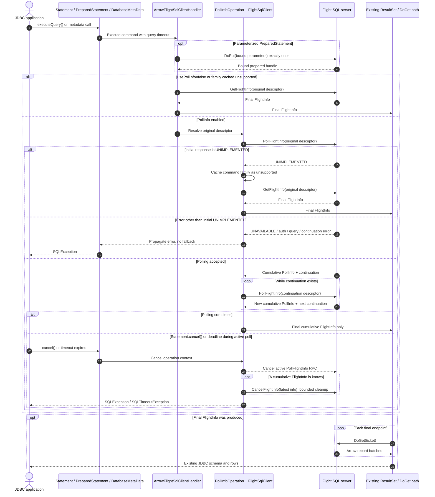

# BDX-645 Arrow Java JDBC PollInfo feasibility report

## Verdict

**Feasible with documented limitations**

The unchanged JDBC interfaces can synchronously execute direct, prepared, and metadata Flight SQL operations through PollFlightInfo, follow continuations to completion, and give only the final cumulative FlightInfo to the existing ResultSet path. This was demonstrated with focused in-process producers and T1-T9 black-box runs against the shared real Flight SQL gRPC fixture. The limitation is production packaging: the POC introduces visible Java helper surfaces across the published `flight-sql` and `flight-sql-jdbc-core` artifacts; those surfaces need an intentional internal/public API design before landing.

## Question answered

Can Arrow Java JDBC make PollInfo the transparent default without changing `java.sql` signatures or result types, while retaining initial-UNIMPLEMENTED-only fallback, per-family capability isolation, one timeout, cancellation before ResultSet construction, and a connection opt-out?

The executable answer is yes. The POC remains experimental and uncommitted on local branch `bdx-645-pollinfo-poc`; nothing was pushed and no Jira/PR state was changed.

## Baseline and environment

- Repository: Apache Arrow Java, shallow checkout under this workstream only.
- Upstream revision: `91b4a2ca418ecb47cb8871d97588b19444337eb4`.
- Initial state: `## main...origin/main`, clean.
- Experimental branch: `bdx-645-pollinfo-poc`.
- Java: 21.0.10; Maven: 3.9.10; RTK: 0.39.0.
- Shared server: reported revision `dev`, private instance at Flight `127.0.0.1:32347` and control `127.0.0.1:32348`. The server binary SHA-256 and unborn-branch status are in `reports/raw/shared-server-revision.log`.
- The repository-pinned `testing` submodule was initialized at `4d209492d514c2d3cb2d392681b9aa00e6d8da1c` to provide existing TLS test certificates.

## Complete call-site inventory

See `reports/call-site-inventory.md` for the required full 13-family table. It records 14 original GetFlightInfo call shapes across 13 distinct wire command families because filtered and unfiltered XDBC type-info methods share `CommandGetXdbcTypeInfo`.

JDBC exposes 11 families: direct statement query, prepared statement query, and nine metadata families. FlightSqlClient additionally exposes statement Substrait and XDBC type info, which are routed through the shared hook but have no current JDBC entry point. Updates, ingest, and schema-only calls are not FlightInfo-producing and remain outside the PollInfo loop.

## Experimental design

### Shared Flight SQL library

`FlightSqlClient` has one protected descriptor-resolution hook. All 13 command families route their final descriptor lookup through it. The default implementation remains exactly one `FlightClient.getInfo`, preserving ordinary FlightSqlClient behavior. A prepared statement now retains its parent FlightSqlClient so its descriptor goes through the same hook after the existing parameter `DoPut` completes.

The Java `FlightProducer` default remains unchanged: `pollFlightInfo` wraps `getFlightInfo` in a completed PollInfo with no continuation. The full regressions, including the updated OAuth interceptor assertion on `POLL_FLIGHT_INFO`, prove that default producer behavior remains transparent.

### JDBC integration

Each JDBC connection installs a polling FlightSqlClient wrapper. For a FlightInfo-producing command it:

1. Derives the capability-cache key from the original Flight SQL `Any.type_url`.
2. Sends the original descriptor to PollFlightInfo once.
3. Sends every returned opaque continuation unchanged once until no continuation remains.
4. Stores the latest cumulative FlightInfo only for cancellation and returns only the final cumulative FlightInfo to the existing endpoint queue/ResultSet path.
5. Falls back to GetFlightInfo only when the initial poll is `UNIMPLEMENTED`, then caches that family as unsupported on the connection. No continuation error and no other initial error falls back.

Direct JDBC statements still use a prepared action for schema/type discovery, but with polling enabled their query-result execution uses `CommandStatementQuery`. With `usePollInfo=false`, the handler deliberately restores the exact pre-POC `CommandPreparedStatementQuery` execution path; both focused and shared-server T6 tests assert that command family. The update branch still invokes the existing prepared `executeUpdate`; the full `ArrowFlightStatementExecuteUpdateTest` passes. Explicit JDBC prepared queries retain `CommandPreparedStatementQuery`; their parameter `DoPut` occurs once before the single original poll descriptor.

The secondary opt-out is URL/connection property `usePollInfo=false`; omission means polling is enabled.

### One deadline and cancellation

`PollInfoOperation` creates one absolute `System.nanoTime` deadline and one gRPC cancellable context per statement execution. Prepared parameter `DoPut`, every poll, and the first endpoint wait all run within that operation; each RPC receives only the remaining budget. This also preserves the existing `SQLTimeoutException` class and exact `Query timed out after N SECONDS` message.

The focused two-poll timeout scenario delays the first poll by 700 ms, blocks the second, and uses a 1-second statement timeout. The final orchestrator rerun completed in 1030 ms with two PollFlightInfo calls. A per-call timeout reset would have allowed roughly 1.7 seconds; the test rejects anything at or above 1.5 seconds. The final shared-server blocked-poll rerun ended in 1008 ms and recorded one active-call termination.

Baseline Avatica has a real pre-ResultSet gap: its bytecode shows `AvaticaStatement.cancel()` only invokes `openResultSet.cancel()` when that field is non-null, then sets a flag. The focused and shared cancellation tests block a continuation, assert `Statement.getResultSet()` is still null, and then call the unchanged public `Statement.cancel()` method. The statement-owned context terminated the calls in 2 ms locally and 9 ms against the shared server. Shared counters were two polls (one original plus one continuation), one active-call termination, one standard CancelFlightInfo action, zero GetFlightInfo calls, and zero DoGet calls. CancelFlightInfo is best effort and is attempted once only when a cumulative FlightInfo has already been received.

## Request flow

The key JDBC boundary is the final-only handoff to the existing ResultSet path. Prepared binding occurs once inside the operation context, and `Statement.cancel()` can interrupt an active poll before a ResultSet exists.

## T1-T10 results

Every T1-T9 case has shared-server evidence wherever the fixture supports the assertion. The focused producer supplements T8 with the required multi-call no-reset proof. Exact machine-readable observations are in `reports/evidence.jsonl`.

| Test | Result | Evidence summary |
| --- | --- | --- |
| T1 immediate | PASS | Rows `[1,2]`; poll 1, GetFlightInfo 0, original 1, continuation 0, DoGet 1. |
| T2 multi-step | PASS | Rows `[1,2,3]`; three polls are exactly one original plus two continuations; ordered descriptors `/op-000001/1`, then `/op-000001/2`; GetFlightInfo 0; DoGet 3. Partial cumulative endpoints were not consumed (otherwise DoGet would exceed 3). |
| T3 prepared | PASS | Bound value 41 yielded `[41,42]`; bind 1; poll 3; original 1; continuation 2; GetFlightInfo 0. |
| T4 metadata | PASS | `DatabaseMetaData.getCatalogs()` returned `bdx_catalog`; poll 3; original 1; continuation 2. |
| T5 fallback/cache | PASS | Two direct executions produced direct poll 1/GetFlightInfo 2, proving connection cache reuse; metadata on the same connection still polled three times and never used GetFlightInfo. |
| T6 opt-out | PASS | `usePollInfo=false`; poll 0, GetFlightInfo 1, normal rows `[1,2]`; the server records the legacy prepared command family. |
| T7 non-fallback failure | PASS | Initial `UNAVAILABLE` propagated with poll 1/GetFlightInfo 0/DoGet 0. A focused continuation-`UNIMPLEMENTED` case propagated after two polls with GetFlightInfo 0. |
| T8 timeout | PASS | Shared blocked poll ended at the one-second deadline with active termination 1 and the exact JDBC timeout contract. Focused two-poll and prepared blocked-bind cases prove the deadline does not reset and covers parameter upload. |
| T9 cancellation | PASS | ResultSet was null during the active continuation; cancel returned in 9 ms shared/2 ms local; shared cancellation 1, active termination 1, GetFlightInfo 0. |
| T10 regression/build | PASS | Flight SQL: 97 tests, zero failures/errors. Final JDBC core rerun after review corrections: 1,267 tests, zero failures/errors, 54 existing skips. |

## Regression details

- Direct SELECT semantics: focused/shared direct tests assert returned rows and the server identifies `CommandStatementQuery`; `ArrowFlightStatementExecuteTest` and `ResultSetTest` pass in the full JDBC suite.
- Timeout and cancellation: PollInfo-specific tests plus existing ResultSet cancellation/timeout tests pass. An initial exact-message regression (`NANOSECONDS` surfaced instead of the legacy `SECONDS` text) was found and fixed while retaining the remaining nanosecond budget internally.
- Updates/DoPut: all ten `ArrowFlightStatementExecuteUpdateTest` cases pass; prepared/update suites pass. Direct updates continue through the existing prepared update path. T3 records exactly one parameter binding.
- Authentication: bearer options are present on PollFlightInfo; the existing OAuth test expectation was updated from the obsolete GetFlightInfo method observation and passes.
- Java producer default: unchanged completed PollInfo implementation plus ResultSet/metadata regressions pass.

## API-surface audit

No standard JDBC method signature, return type, or user ResultSet type changed. `Statement.cancel()` and `PreparedStatement.cancel()` are overrides of existing methods, not new JDBC API.

The POC does expand Java surface visible in published artifacts:

- protected `FlightSqlClient.getInfo(FlightDescriptor, CallOption...)`;
- public JDBC implementation-layer `PollInfoOperation`;
- handler `prepareDirect`, builder `withPollInfo`, the prepared-handler operation overload, and config getter `usePollInfo`.

The added protected method can also create a downstream source-compatibility collision if a FlightSqlClient subclass already declares an identically shaped method with weaker visibility. `reports/raw/api-surface-added-lines.log` captures the audit. This is the principal reason the experiment is not a production-ready patch even though the unchanged JDBC interface is feasible.

## Commands and exit evidence

All commands were run locally with RTK and no remote mutation.

| Command | Exit/result | Raw evidence |
| --- | --- | --- |
| `mvn -pl flight/flight-sql -DskipTests install` | 0; shared hook compiled, checked, installed locally | `reports/raw/install-flight-sql-hook.log` |
| `mvn -pl flight/flight-sql-jdbc-core -Dtest=PollInfoExecutionTest test` | 0; final focused rerun 12/12 | original log plus orchestrator validation |
| `mvn -pl flight/flight-sql-jdbc-core -Dtest=SharedServerPollInfoExecutionTest -Dpollinfo.shared.enabled=true -Dpollinfo.shared.flightPort=32347 -Dpollinfo.shared.controlPort=32348 test` | 0; 9/9 | `reports/raw/shared-server-t1-t9-final.log` |
| `mvn -pl flight/flight-sql test` | 0; 97/97 | `reports/raw/t10-flight-sql-tests.log` |
| `mvn -pl flight/flight-sql-jdbc-core test` | 0; final rerun 1,267 tests, 54 skipped | original log plus orchestrator validation |
| `mvn -pl flight/flight-sql,flight/flight-sql-jdbc-core -DskipTests package` | 0; both artifacts compiled, formatted, checked, and packaged | `reports/raw/t10-final-package.log` |
| focused OAuth/TLS rerun | 0; 50/50 after expected-method fix and test-data initialization | `reports/raw/t10-prior-failures-rerun.log` |
| `git diff --check` | 0 | final command output/working-tree check |

The first focused invocation mistakenly linked the previously installed Flight SQL snapshot and consequently observed zero polls; `reports/raw/pollinfo-focused-test.log` preserves that diagnostic. Installing the modified shared module corrected the test classpath and the same tests passed. The first complete JDBC run records the OAuth expectation mismatch and missing submodule data in `reports/raw/t10-jdbc-core-tests.log`; the final run is clean.

## Changed files

Production POC:

- `flight/flight-sql/src/main/java/org/apache/arrow/flight/sql/FlightSqlClient.java`
- `flight/flight-sql-jdbc-core/src/main/java/org/apache/arrow/driver/jdbc/ArrowFlightConnection.java`
- `flight/flight-sql-jdbc-core/src/main/java/org/apache/arrow/driver/jdbc/ArrowFlightJdbcFlightStreamResultSet.java`
- `flight/flight-sql-jdbc-core/src/main/java/org/apache/arrow/driver/jdbc/ArrowFlightMetaImpl.java`
- `flight/flight-sql-jdbc-core/src/main/java/org/apache/arrow/driver/jdbc/ArrowFlightPreparedStatement.java`
- `flight/flight-sql-jdbc-core/src/main/java/org/apache/arrow/driver/jdbc/ArrowFlightStatement.java`
- `flight/flight-sql-jdbc-core/src/main/java/org/apache/arrow/driver/jdbc/client/ArrowFlightSqlClientHandler.java`
- `flight/flight-sql-jdbc-core/src/main/java/org/apache/arrow/driver/jdbc/client/PollInfoOperation.java`
- `flight/flight-sql-jdbc-core/src/main/java/org/apache/arrow/driver/jdbc/utils/ArrowFlightConnectionConfigImpl.java`

Test/evidence support:

- `flight/flight-sql-jdbc-core/src/test/java/org/apache/arrow/driver/jdbc/OAuthIntegrationTest.java`
- `flight/flight-sql-jdbc-core/src/test/java/org/apache/arrow/driver/jdbc/PollInfoExecutionTest.java`
- `flight/flight-sql-jdbc-core/src/test/java/org/apache/arrow/driver/jdbc/SharedServerPollInfoExecutionTest.java`
- `flight/flight-sql-jdbc-core/src/test/java/org/apache/arrow/driver/jdbc/utils/MockFlightSqlProducer.java`
- `flight/flight-sql-jdbc-core/src/test/java/org/apache/arrow/driver/jdbc/utils/PollingMockFlightSqlProducer.java`
- `reports/call-site-inventory.md`, `reports/evidence.jsonl`, this report, raw logs, and `reports/arrow-java-bdx-645.patch`.

## Limitations

- The visible helper surfaces listed in the API audit need redesign or explicit compatibility review before production.
- Direct statements still perform the existing prepare action for schema/type discovery before sending `CommandStatementQuery`; this adds no new preparation round trip but means the statement timeout/cancellable context begins at PollInfo execution, not at schema preparation. PollInfo calls and first endpoint retrieval do share one deadline.
- The corrected prepared path includes parameter upload in that same deadline/context; schema discovery remains outside it as described above.
- Capability caching is connection/handler scoped and keyed by Flight SQL command type URL. Production code should make the physical-connection ownership explicit if connection pooling/reuse is broadened.
- The shared fixture intentionally covers direct, prepared, and catalogs metadata only. All other JDBC-exposed metadata families route through the same shared hook and pass the full JDBC regressions, but do not have distinct shared-server black-box scenarios.
- Best-effort CancelFlightInfo is possible only after a PollInfo response supplies cumulative FlightInfo. A timeout/cancel on the initial blocked poll can terminate the RPC context but has no FlightInfo payload to send to the cancel action.
- The Java cleanup action is synchronous but independently bounded to one second. A production implementation should ensure a slow server cannot delay primary timeout delivery or cancellation completion.
- No unchanged-response backoff, retry policy, or production telemetry was added; those are production-hardening concerns and were not part of the frozen POC contract.

## Smallest production follow-up

### Arrow Java Flight SQL shared library

1. Define an intentional descriptor-resolution abstraction with compatibility review, avoiding an accidental protected-hook collision in `FlightSqlClient`.
2. Place the PollInfo operation state/capability cache behind non-public or explicitly supported shared-library APIs, with final-only handoff and initial-UNIMPLEMENTED semantics covered at that layer.
3. Add shared-library unit tests for all command constructors, default producer completion, continuation validation, and optional bounded unchanged-response delay.

### JDBC integration and hardening

1. Hide the statement operation carrier and direct-query adapter behind JDBC-internal package boundaries while retaining `usePollInfo` as a documented connection property.
2. Decide whether the operation deadline should include schema preparation; if yes, create the context at `prepareAndExecute` entry and carry its remaining budget through PollInfo and first endpoint retrieval.
3. Add pooled/physical-connection lifecycle tests for per-family unsupported caching and cancellation races, plus black-box fixture coverage for additional metadata families when the fixture grows.
4. Retain the direct select/update, OAuth, default producer, timeout-message, prepared single-bind, and pre-ResultSet cancellation regressions from this experiment.

## Artifacts

- Machine-readable evidence: `reports/evidence.jsonl`
- Complete call-site inventory: `reports/call-site-inventory.md`
- Experimental patch: `reports/arrow-java-bdx-645.patch`
- Raw command/server logs: `reports/raw/`
